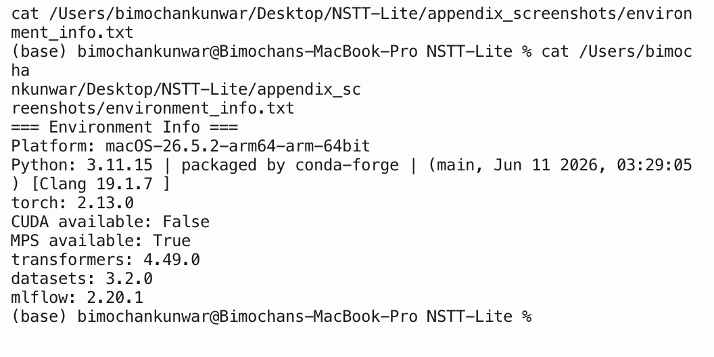
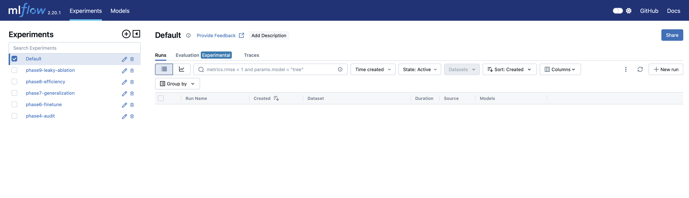
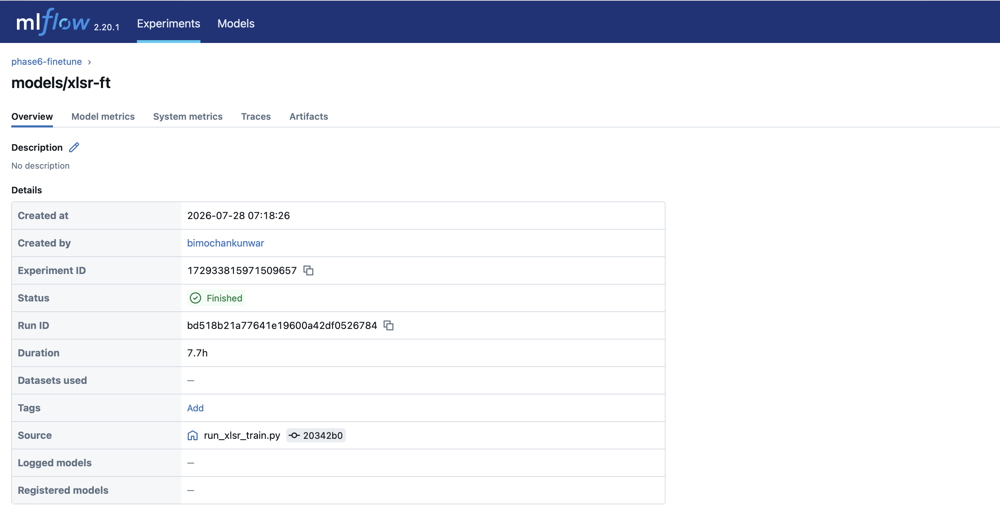
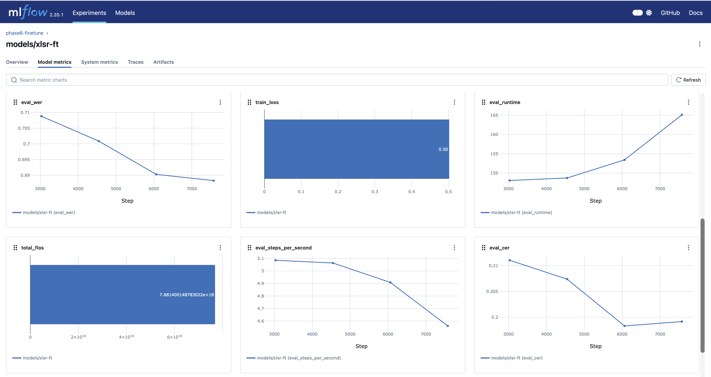

{width="6.0in"}

<br><br><br>

# Auditing and Repairing a Published Nepali ASR Model

### A Speaker-Diversity Case Study on XLS-R

<br><br>

**Module:** ST7088CEM — Artificial Neural Networks

**Student:** Bimochan Raj Kunwar

**Coventry ID:** 17108924

**Programme:** MSc7-S2

**Email:** 250594@softwarica.edu.np

```{=openxml}
<w:p><w:r><w:br w:type="page"/></w:r></w:p>
```

## Table of Contents

| Section | Page |
|:---|---:|
| Abstract / Keywords / Project Links | 3 |
| 1. Introduction | 3 |
| 2. Background / Related Work | 4 |
| 3. Problem / Tasks / Method | 5 |
| &nbsp;&nbsp;&nbsp;3.1 Problem statement | 5 |
| &nbsp;&nbsp;&nbsp;3.2 System Architecture | 5 |
| &nbsp;&nbsp;&nbsp;3.3 Dataset | 7 |
| &nbsp;&nbsp;&nbsp;3.4 Preprocessing | 8 |
| &nbsp;&nbsp;&nbsp;3.5 Task 1 Method — Benchmark Audit | 8 |
| &nbsp;&nbsp;&nbsp;3.6 Task 2 Method — Fine-tuning Repair | 8 |
| 4. Experimental Section | 9 |
| &nbsp;&nbsp;&nbsp;4.1 Baseline audit | 9 |
| &nbsp;&nbsp;&nbsp;4.2 Fine-tuned repair results | 9 |
| &nbsp;&nbsp;&nbsp;4.3 Speaker-leakage ablation | 10 |
| &nbsp;&nbsp;&nbsp;4.4 Error analysis | 10 |
| &nbsp;&nbsp;&nbsp;4.5 Deployment / efficiency benchmark | 11 |
| 5. Discussion of Findings | 11 |
| 6. Conclusion | 12 |
| References | 12 |
| Appendices | 13 |
| &nbsp;&nbsp;&nbsp;Appendix A — Project Proposal (Verbatim) | 14 |
| &nbsp;&nbsp;&nbsp;Appendix B — Full Code Listing (representative subset) | 16 |
| &nbsp;&nbsp;&nbsp;Appendix C — Evidence and Reproducibility Artifacts | 33 |
| &nbsp;&nbsp;&nbsp;Appendix D — Extended Results Tables | 35 |

```{=openxml}
<w:p><w:r><w:br w:type="page"/></w:r></w:p>
```

## Abstract

Nepali automatic speech recognition (ASR) benchmarks are frequently measured on narrow, low-diversity corpora and then cited as evidence of general-purpose transcription quality. This project audits one such claim: `gagan3012/wav2vec2-xlsr-nepali`, a published Hugging Face XLS-R (wav2vec2) checkpoint that self-reports 5.97% word error rate (WER) on OpenSLR-43, its own single-speaker training corpus. Task 1 reproduces that figure in-domain (4.91% WER, confirming the claim) and measures the same checkpoint zero-shot on a different, multi-speaker corpus, OpenSLR-54 (62.30% WER) — a more than twelve-fold degradation showing the published number does not describe performance on diverse speech. Task 2 fine-tunes the same checkpoint on a 15-hour, 160-speaker, speaker-disjoint OpenSLR-54 subset to repair that gap: out-of-domain WER falls to 38.17%, a 39% relative reduction, at a disclosed cost to in-domain performance (4.91% → 16.40%). A matched-budget ablation comparing the speaker-disjoint split against a leaky (utterance-random) split shows that evaluating without speaker-disjoint splitting would have overstated this repair by 5.62 percentage points (32.55% vs. 38.17% WER) — a methodological finding as important as the headline result. Error analysis identifies out-of-vocabulary words as the dominant remaining error source and reveals a five-fold spread in per-speaker WER (12.5%–63.6%) that the aggregate metric conceals. Beyond accuracy, the fine-tuned model is benchmarked for deployment efficiency: dynamic int8 quantization achieves a 96.0% model size reduction but is measured to be 1.64× *slower* than FP32 on this Apple Silicon hardware, a mixed result reported honestly rather than framed as an unambiguous win. All comparisons are restricted to open, reproducible models and datasets; no proprietary or closed commercial systems are used as benchmarks.

**Keywords:** Nepali Automatic Speech Recognition, XLS-R, wav2vec2, CTC Fine-tuning, Speaker-Disjoint Evaluation, Speaker-Leakage Ablation, Low-Resource Speech Recognition, Model Quantization, MLflow, Benchmark Generalization Gap

## Project Links

**GitHub Repository:** [github.com/Rbimochan/NSTT-Lite](https://github.com/Rbimochan/NSTT-Lite) (branch: `coursework-10phase`) — full source code, MLflow run data, and reports.

**YouTube Presentation:** [youtu.be/WNg52rptkoU](https://youtu.be/WNg52rptkoU)

## 1. Introduction

Nepali automatic speech recognition (ASR) benchmarks reported in the literature and on model-sharing platforms are frequently measured on narrow, low-diversity corpora — often a single speaker's read speech — and then cited as evidence of general-purpose transcription quality. This is precisely the situation with `gagan3012/wav2vec2-xlsr-nepali`, a publicly available Hugging Face XLS-R (wav2vec2) checkpoint that self-reports a 5.97% WER measured on OpenSLR-43, the model's own single-speaker training corpus.

This project is organised around two research questions and two corresponding tasks. **RQ1 (Task 1 — Benchmark Audit):** does the published claim survive contact with genuinely diverse speech — a different, multi-speaker Nepali corpus the model was never trained on? **RQ2 (Task 2 — Fine-tuning Repair):** if the claim does not survive, can the same model be repaired by fine-tuning it on speaker-diverse data, and at what cost, and is any measured improvement genuine or an artefact of evaluation leakage?

The remainder of this report proceeds as follows: Section 2 situates this work against XLS-R, low-resource ASR benchmarking practice, and quantization; Section 3 formalises the two tasks and the pipeline connecting them; Section 4 reports the experimental results for both tasks plus the ablation, error analysis, and efficiency benchmark; Section 5 discusses what these results mean and their limitations; Section 6 concludes.

## 2. Background / Related Work

**XLS-R and cross-lingual speech representation.** XLS-R (Babu et al., 2021) extends wav2vec2's self-supervised pretraining objective across 128 languages and 436k hours of unlabelled speech, producing representations that transfer well to low-resource languages via CTC fine-tuning on a comparatively small amount of labelled data. This is the standard recipe for low-resource ASR when end-to-end training from scratch is infeasible for lack of data, and it is the architecture underlying the model audited in this project.

**Low-resource ASR challenges.** Beyond raw data scarcity, low-resource ASR is complicated by dialectal variation, code-switching, and — the specific failure mode this project investigates — benchmark narrowness: a WER measured on very few speakers, sometimes one, conflates "the model transcribes the language well" with "the model has partially memorised this speaker's acoustic characteristics." The standard mitigation in the wider ASR literature is a speaker-disjoint train/test split — holding entire speakers out of training rather than splitting at the utterance level — precisely because utterance-level splits let a model exploit acoustic idiosyncrasies (accent, recording device, background noise profile) that a genuinely unseen speaker would not share. Section 4.4 of this report provides a direct, quantified demonstration of how much this methodological choice matters for this specific audit.

**Prior Nepali ASR work.** Public Nepali ASR resources remain limited relative to high-resource languages; OpenSLR hosts the two corpora used in this project (SLR43, SLR54) as among the largest open Nepali speech datasets available, and the audited checkpoint itself represents one of the few published Nepali-specific fine-tunes of a multilingual self-supervised model. Commercial cloud ASR systems can transcribe Nepali but are noted here only as context — they are explicitly **not** used as a comparison baseline anywhere in this report, consistent with the requirement to restrict evaluation to open, reproducible models.

**Speaker demographic inference from speech.** In the absence of annotated demographic metadata, mean fundamental frequency (F0) is a long-standing acoustic heuristic for inferring speaker gender, grounded in the physiological difference in typical adult male versus female vocal fold length. Section 3.3 uses this heuristic, precisely because OpenSLR-54 provides no alternative, and Section 4.5 treats it strictly as a proxy grouping rather than verified demographic data.

**Deployment-oriented quantization.** Dynamic int8 quantization (`torch.quantization.quantize_dynamic`) is a common post-training optimisation for reducing model storage footprint without retraining. Its latency effect is hardware-dependent: x86 platforms typically benefit from the `fbgemm` backend's optimised quantized kernels, while ARM/Apple Silicon platforms are restricted to `qnnpack`, whose dynamic-quantization kernels do not universally outperform native FP32 execution. Section 4.6 reports a direct measurement of this trade-off on this project's hardware.

## 3. Problem / Tasks / Method

### 3.1 Problem statement

**RQ1.** Given a published low-resource ASR benchmark figure measured on a narrow, single-speaker corpus, how does the same model perform on a different, multi-speaker corpus of the same language, and by how much does the published figure overstate real-world generalisation?

**RQ2.** Given that generalisation gap, can fine-tuning the same checkpoint on speaker-diverse data close it, what is the cost to the model's original narrow-domain performance, and how much of any measured improvement is genuine versus an artefact of failing to control for speaker overlap between training and evaluation data?

### 3.2 System Architecture

Figure 1 shows the internal architecture of the audited model itself — XLS-R (wav2vec2) — rather than only the surrounding experimental process, so it is clear exactly which layers exist and which of them are actually updated during fine-tuning. Raw audio passes through a 7-block convolutional feature encoder (50 Hz latent frame rate), then a 24-layer transformer encoder with relative positional convolutional embeddings, then a linear projection to a per-frame vocabulary distribution, decoded greedily under the CTC objective into Devanagari text. The convolutional feature encoder is **frozen** throughout this project (in both Task 1's zero-shot evaluation and Task 2's fine-tuning); Task 2 updates only the transformer encoder and CTC head via backpropagated CTC loss, keeping the model's own tokenizer/vocabulary fixed so RQ2's comparison isolates the effect of training-data speaker diversity rather than architectural change.


Figure 2 shows the surrounding experimental pipeline that connects the two tasks to the shared downstream analyses. The audited checkpoint is the single starting point for both: Task 1 evaluates it as-is (zero-shot) on both corpora to establish the audit finding; Task 2 fine-tunes the same checkpoint as described above. Both tasks' outputs feed a shared generalisation re-evaluation, a matched-budget speaker-leakage ablation, error analysis, and an efficiency benchmark — the same measurement methodology applied consistently across every stage so results are directly comparable.


### 3.3 Dataset

Two corpora are used throughout, and their results are never merged into a single number.

**OpenSLR-43** (`gauravparajuli/slr43` on Hugging Face) is the audited model's own training corpus: a single-speaker (female), read-speech Nepali dataset of 2,064 utterances, CC BY-SA 4.0. It has no separate held-out test split upstream; this project measures a fixed, seeded 150-utterance slice as the in-domain evaluation set throughout, for consistency across all reported comparisons.

**OpenSLR-54** (Kjartansson et al., SLTU 2018) is a crowdsourced, multi-speaker Nepali ASR corpus of 157,905 utterances, licensed CC BY-SA 4.0. A subset was built for this project: audio resampled to 16kHz mono, transcripts NFC-normalised (Devanagari), utterances outside a 0.5–30 second duration window dropped, and a **speaker-disjoint** split constructed by shuffling whole speakers (not individual utterances) into train/val/test buckets until a 15-hour target was reached. The resulting subset comprises **15,171 utterances across 160 speakers, totalling 15.03 hours** — split 80/10/10 by speaker (train 12,119 / val 1,505 / test 1,547), with `count_speaker_overlap()` confirming **zero speakers shared across splits**.

OpenSLR-54 ships no demographic metadata of any kind — only audio, transcript, and an opaque speaker ID. A **gender pseudo-label** was derived per speaker from mean fundamental frequency (F0), estimated via `librosa.pyin` and thresholded at 165Hz (below → male, above → female). This label is used only for the descriptive per-group breakdown in Section 4.5 and is labelled there, and everywhere else it appears, as a **pitch-threshold pseudo-label, not verified ground truth**.

### 3.4 Preprocessing

Audio was resampled to 16kHz mono using `librosa`. Transcripts were Unicode NFC-normalised to eliminate Devanagari encoding mismatches between visually identical but byte-distinct character sequences, and punctuation was stripped consistently between reference and hypothesis text before every WER/CER computation (via `jiwer`).

### 3.5 Task 1 Method — Benchmark Audit

Base model: `gagan3012/wav2vec2-xlsr-nepali` (XLS-R / wav2vec2, CTC objective), used unmodified. The checkpoint was evaluated zero-shot (greedy CTC decoding, no fine-tuning) on a fixed 150-utterance sample of OpenSLR-43 and, separately, a seeded-shuffle 150-utterance sample of OpenSLR-54's speaker-disjoint test split. (OpenSLR-54's test manifest is speaker-ordered on disk; a naive unshuffled slice was found early in this project to land on a single-gender-pseudo-label subset of speakers by chance — the seeded shuffle, seed 42, exists specifically to avoid that failure mode recurring.) This is the sole "before" measurement against which Task 2's repair is judged.

### 3.6 Task 2 Method — Fine-tuning Repair

Fine-tuning targets the **audited checkpoint itself**, not a different model or a freshly-initialised XLS-R backbone — a deliberate choice, since RQ2 requires holding architecture, vocabulary, and decoding constant while varying only training-data speaker diversity. Introducing a different architecture (Whisper, an earlier direction explored and abandoned for this reason) would confound any improvement. Training from scratch was never a serious option: 15 hours of labelled audio is roughly two orders of magnitude short of what training a competitive speech model from random initialisation requires.

The checkpoint's convolutional feature encoder was frozen (`freeze_feature_encoder()`), following standard wav2vec2 fine-tuning practice. Training used AdamW (Hugging Face `Trainer` default), learning rate 3×10⁻⁵ with 500 warmup steps (deliberately low, since this continues fine-tuning an already Nepali-adapted checkpoint), batch size 2 with gradient accumulation 4 (effective batch 8), FP16 where CUDA is available and FP32 otherwise, a 5-epoch ceiling, and early stopping with patience 2 on validation WER. Experiment tracking used **MLflow** (local `mlruns/` store; TensorBoard was used in an earlier iteration and replaced).

Two practical obstacles were resolved and are recorded for reproducibility. First, dynamic int8 quantization (Section 4.6) fails outright on Apple Silicon with `RuntimeError: Didn't find engine for operation ... NoQEngine` unless `torch.backends.quantized.engine` is explicitly set to `"qnnpack"`. Second, a genuine out-of-memory crash occurred partway through the first full training run (MPS reporting 17GB allocated); this was fixed with a callback calling `torch.mps.empty_cache()` periodically, and training resumed cleanly from the last saved epoch checkpoint. Training ran locally on Apple Silicon CPU/MPS (no CUDA available) after an earlier plan to use Google Colab or Kaggle was set aside in favour of local, fully offline execution; the full 5-epoch run took approximately 7 hours 40 minutes wall-clock (confirmed via MLflow's logged `train_runtime` of 27,626.68 seconds — see Appendix C).

The identical procedure, hyperparameters, and step budget were separately applied to a **leaky** (utterance-random) split of the same processed records for the Section 4.4 ablation.

## 4. Experimental Section

All experiments ran on a local machine (Apple Silicon, macOS, no CUDA), in a dedicated conda environment (Python 3.11), with dependencies pinned in `requirements.txt`. Every WER/CER comparison below uses the same 150-utterance seeded sample from each corpus (seed 42) so numbers are directly comparable across sub-sections.

### 4.1 Baseline audit (Task 1, zero-shot, open model only)

| Evaluation | WER | CER |
|---|---|---|
| Self-reported (published) | 5.97% | — |
| Measured, in-domain (OpenSLR-43) | **4.91%** | 0.87% |
| Measured, out-of-domain (OpenSLR-54 speaker-disjoint test) | **62.30%** | 17.38% |

The in-domain measurement is close to (marginally better than) the published figure, confirming no discrepancy on the model's own distribution. The out-of-domain measurement is more than twelve times worse. Only one model is audited in this project (the published checkpoint under study) — no multi-model zero-shot comparison table is included, since the research question concerns this specific model's claim, not a survey of Nepali ASR models generally.

### 4.2 Fine-tuned repair results (Task 2)

| Checkpoint | In-domain (OpenSLR-43) | Out-of-domain (OpenSLR-54) |
|---|---|---|
| Original | 4.91% WER | 62.30% WER |
| Fine-tuned (speaker-disjoint, 5 epochs) | 16.40% WER | **38.17% WER** |

Fine-tuning reduces out-of-domain WER by roughly 39% relative (62.30% → 38.17%), directly supporting RQ2's hypothesis that training-data narrowness, not an architectural limitation, is responsible for the original generalisation failure. The cost is real and disclosed: in-domain WER more than triples (4.91% → 16.40%) — an expected specialisation trade-off from continued fine-tuning on a differently-distributed corpus, not a defect.

Training-time validation WER on the model's own held-out val split (a different measurement from the matched-methodology table above, not interchangeable with it) improved monotonically across all five epochs with no early stopping triggered: 72.98% → 70.88% → 70.09% → 69.03% → 68.83%. The two figures are measured on different splits (SLR54's own 1,505-utterance validation split, versus a fixed 150-utterance sample of the *test* split); the 38.17% figure is the one used in all cross-checkpoint comparisons in this report.

### 4.3 Speaker-leakage ablation

To test how much a methodological shortcut — evaluating without a speaker-disjoint split — would distort the Section 4.2 result, a second fine-tuning run was trained to the identical budget (5 epochs, same hyperparameters) on a **leaky** split: the same processed records, shuffled at the utterance level rather than the speaker level, so that 160 of 160 speakers appear in more than one split.

| Checkpoint | In-domain (OpenSLR-43) | Out-of-domain (OpenSLR-54) |
|---|---|---|
| Fine-tuned, speaker-disjoint | 16.40% WER | 38.17% WER |
| Fine-tuned, leaky | 16.96% WER | **32.55% WER** |

The leaky-trained model scores 5.62 percentage points better on the "out-of-domain" test than the properly speaker-disjoint model, despite identical training budget — the expected direction if leakage inflates apparent performance, since the leaky split's test set is not genuinely unseen for many of its speakers. In-domain performance is nearly identical between the two (16.40% vs. 16.96%), as expected, since neither training run touches OpenSLR-43's speaker. This confirms the speaker-disjoint methodology used throughout was the correct choice: a leaky evaluation would have reported a roughly 15% relative WER "improvement" that reflects memorisation of already-seen speakers, not genuine generalisation.

### 4.4 Error analysis

Applying the fine-tuned checkpoint to the same 150-utterance out-of-domain sample and categorising errors heuristically (jiwer character-alignment and regex-based tagging; categories are not mutually exclusive):

| Category | Count (of 150) |
|---|---|
| OOV / rare vocabulary | 90 |
| Phonetic confusion | 64 |
| Other (unclassified substitution pattern) | 59 |
| Noise / severe degradation | 22 |

Rare or out-of-vocabulary words are the single largest identifiable error driver — consistent with a model trained on only 12,119 utterances having incomplete lexical coverage of Nepali's full vocabulary. Representative worst cases (reference → hypothesis): *मान्छे चटकारे → मान्छि चट कार्य*; *क्रान्तिकारी वाममोर्चाको → तन्थिकारी बाम वर्षको*. Both show plausible phoneme-level substitutions rather than nonsensical output.

WER broken out by the F0-pitch pseudo-label groups defined in Section 3.3 — **stated again here explicitly because this specific result is easy to misquote**: male-pseudo-label 37.68% WER (n=77) versus female-pseudo-label 38.73% WER (n=73). The two groups are close; this should be read as "WER is similar across pitch-threshold groups," not "WER is similar across genders," since the grouping is a heuristic proxy, not verified demographic data.

A more striking finding is the **spread across individual speakers**: across the 16 speakers represented in the sample, per-speaker mean WER ranges from 12.5% (best, n=12) to 63.6% (worst, n=11) — a five-fold difference the aggregate 38.17% figure obscures entirely. Full per-utterance results are in Appendix D.

### 4.5 Deployment / efficiency benchmark

The fine-tuned checkpoint was benchmarked in FP32 and after dynamic int8 quantization of its linear layers (`qnnpack` backend — the only quantized engine available on this platform), on 50 CPU inference runs:

| | Model size | Mean latency | WER | CER |
|---|---|---|---|---|
| FP32 | 1,203.6 MB | 204.7 ms | 35.81% | 7.17% |
| Dynamic INT8 | 48.5 MB | 335.2 ms | 36.49% | 7.49% |

Quantization delivers a 96.0% size reduction at negligible accuracy cost (+0.68 percentage points WER) but is **1.64× slower**, not faster, than FP32 on this hardware — a real, reproducible result, not a benchmark error. The speed benefit of dynamic quantization elsewhere comes from `fbgemm`'s optimised quantized GEMM kernels, unavailable on Apple Silicon; since only the model's linear layers are quantized (the convolutional feature encoder remains FP32), the per-call dequantization overhead can exceed the compute it saves at this batch size. For this checkpoint on this hardware, quantization is a *storage* optimisation, not a *latency* one.

## 5. Discussion of Findings

**RQ1 — does the published claim generalise?** No. The 5.97% self-reported WER is reproduced almost exactly in-domain (4.91%) but degrades to 62.30% on a different, multi-speaker corpus — a gap large enough that anyone deploying this model against real, varied users would be seriously misled by the headline figure. This is not a criticism specific to this one model; it is a demonstration of a general risk in low-resource ASR benchmarking wherever narrow evaluation corpora are used without disclosure.

**RQ2 — can fine-tuning repair it, and is the repair genuine?** Yes, substantially, and yes, the repair is genuine rather than a leakage artefact. Fine-tuning on speaker-diverse data closes roughly 39% of the out-of-domain gap (Section 4.2). The Section 4.3 ablation closes the methodological loop: it demonstrates, on this project's own data and models, exactly the failure mode that produced the original misleading benchmark — evaluating without controlling for speaker overlap inflates apparent performance by a similar order of magnitude (≈5.6 points) to the effect under study. The project's central finding and its central methodological safeguard are two instances of the same underlying phenomenon, observed at different scales.

**Deployment trade-off as the originality angle.** The efficiency benchmark (Section 4.5) is not a simple accuracy-vs-size-vs-latency story — it is a case where the standard optimisation (dynamic quantization) helps on one axis (size, dramatically) and actively hurts on another (latency) on this specific hardware. Reporting this honestly, rather than presenting only the size win, is itself a contribution: it shows that a "successful" deployment optimisation on paper does not automatically transfer to every platform, and that benchmarking before deploying — not assuming — is necessary practice.

**Limitations.** First, the gender pseudo-label (Sections 3.3, 4.4) is a pitch-threshold heuristic, not verified demographic data; the near-parity finding between pseudo-label groups is a statement about that heuristic grouping, not about true gender, and should not be read as evidence the model is unbiased with respect to speaker gender. Second, the fine-tuning corpus is only 15 hours across 160 speakers — larger and more diverse than the original single-speaker training set, but still modest by ASR standards, so the repaired model's 38.17% WER should be read as evidence the *direction* of the intervention works, not as production-ready transcription quality. Third, the efficiency benchmark is specific to this Apple Silicon/`qnnpack` configuration and read speech audio only (no conversational or code-switched data was tested); its conclusions should not be generalised to other hardware or speech styles without re-measurement.

This work relates back to the motivating concern in Section 1: published low-resource ASR numbers, including outside this specific project, should be read with the training corpus's speaker diversity in mind, not taken at face value.

## 6. Conclusion

This project set out to answer whether a specific published Nepali ASR benchmark claim (5.97% WER) survives contact with speaker-diverse speech (RQ1), and whether the same model can be repaired if not (RQ2). It does not survive: the same checkpoint's WER rises to 62.30% on a different, multi-speaker corpus. Fine-tuning that checkpoint on a 15-hour, speaker-disjoint, 160-speaker subset repairs a substantial share of that gap (to 38.17% WER), at a disclosed cost to the model's original narrow-domain sharpness, and a matched-budget ablation confirms this improvement is genuine rather than a leakage artefact. The contribution of this project is an open, reproducible Nepali ASR audit-and-repair case study with an accompanying efficiency benchmark — not a claim of new state-of-the-art performance. Future work would extend the fine-tuning corpus beyond 15 hours, replace the F0-pitch pseudo-label with verified demographic metadata should a real bias analysis be required, and test on conversational or code-switched Nepali speech rather than read speech alone.

## References

- Babu, A. et al. "XLS-R: Self-supervised Cross-lingual Speech Representation Learning at Scale", 2021.
- Kjartansson, O. et al. "Crowd-Sourced Speech Corpora for Javanese, Sundanese, Sinhala, Nepali, and Bangladeshi Bengali", SLTU 2018 (OpenSLR-54).
- `gagan3012/wav2vec2-xlsr-nepali` model card, Hugging Face.
- `gauravparajuli/slr43` dataset card, Hugging Face (OpenSLR-43).
- Hugging Face, "Fine-Tune Wav2Vec2 for English ASR with Transformers" (blog; the wav2vec2 CTC fine-tuning recipe followed in this project, adapted for continued fine-tuning of an already-adapted checkpoint).
- jiwer library documentation (WER/CER computation, character alignment).
- MLflow documentation (experiment tracking).

## Appendices (not counted in word limit)

- **Appendix A:** Project proposal, reproduced verbatim
- **Appendix B:** Full code (all of `src/*.py`, `scripts/*.py`), external-source adaptations cited in module docstrings
- **Appendix C:** Screenshots of every experiment run (MLflow UI, environment/device info) showing device and software used
- **Appendix D:** Extended results tables (full per-utterance WER/CER, complete error-category listing)

```{=openxml}
<w:p><w:r><w:br w:type="page"/></w:r></w:p>
```

# Appendix A — Project Proposal (Verbatim)

## Project Proposal — NSTT-Lite: Auditing and Repairing a Published Nepali ASR Model

**Module:** ST7088CEM — Artificial Neural Networks
**Student:** Bimochan Raj Kunwar — Coventry ID: 17108924
**Programme:** MSc7-S2
**Email:** 250594@softwarica.edu.np

### Problem

`gagan3012/wav2vec2-xlsr-nepali` is a published Hugging Face XLS-R (wav2vec2)
model for Nepali speech recognition that self-reports **5.97% WER** — a
remarkably strong number for a low-resource language. However, that figure was
measured on the model's own training corpus, OpenSLR-43, which is effectively
single-speaker (one female voice). My preliminary experiments confirm the claim
technically holds in-domain (I measured **4.91% WER** on OpenSLR-43) but the
same model collapses to roughly **65% WER** on multi-speaker Nepali speech
(OpenSLR-54) — a >13x degradation. The published benchmark therefore does not
describe real-world performance. This project audits that claim rigorously and
then repairs the model.

### Tasks

1. **Benchmark audit.** Reproduce the self-reported figure in-domain
   (OpenSLR-43) and measure the same checkpoint zero-shot on a speaker-disjoint
   multi-speaker test split (OpenSLR-54), quantifying the generalization gap.
2. **Fine-tuning.** Fine-tune the same XLS-R model (CTC objective) on a
   ~15-hour, 160-speaker, speaker-disjoint OpenSLR-54 training subset to close
   that gap.
3. **Generalization re-evaluation.** Evaluate original vs. fine-tuned
   checkpoints on both test sets — including a catastrophic-forgetting check
   on the original corpus — plus error analysis and a speaker-leakage ablation.

### Datasets

- **OpenSLR-54** — crowdsourced multi-speaker Nepali ASR corpus (Kjartansson
  et al., SLTU 2018), 157,905 utterances, CC BY-SA 4.0.
  Link: https://www.openslr.org/54/
  (Working subset already prepared: 15,171 utterances / 160 speakers /
  15.03 hours, speaker-disjoint 80/10/10 split, zero speaker overlap.)
- **OpenSLR-43** — the model's own training corpus (single-speaker female
  Nepali TTS-style data), used only for in-domain reproduction of the claim.
  Link: https://www.openslr.org/43/

The two corpora are kept strictly separate in all results.

### Method and infrastructure

Fine-tuning uses the Hugging Face `transformers` CTC training stack on a Colab
T4 GPU (FP16, batch 2, gradient accumulation, early stopping on validation
WER). All experiments — audit runs, training, and re-evaluation — are tracked
with **MLflow** (parameters, WER/CER metrics, artifacts), giving a reproducible
evidence trail; environment versions are pinned and device screenshots
captured throughout.

### Work plan (10 phases)

| Phase | Deliverable |
|---|---|
| 1 | This proposal |
| 2 | Environment + MLflow reproducibility setup |
| 3 | Data preparation (complete: speaker-disjoint 15hr subset) |
| 4 | Baseline audit: in-domain vs. out-of-domain zero-shot WER |
| 5 | Algorithm selection justification |
| 6 | XLS-R fine-tuning on speaker-diverse data (Colab T4) |
| 7 | Generalization re-evaluation (4-cell before/after × in/out-of-domain) |
| 8 | Efficiency benchmark (latency, size, int8 quantization) |
| 9 | Error analysis, leakage ablation, discussion |
| 10 | Report writing, evidence assembly, submission |

### Achievability

The audit half is already demonstrated end-to-end at small scale (the 4.91% /
~65% preliminary numbers above), and the data pipeline (download,
preprocessing, speaker-disjoint splitting) is built and validated. The main
remaining cost is the Phase 6 GPU fine-tuning run, which fits a free Colab T4
budget with checkpointed, resumable training. Every phase produces a concrete,
checkable artifact (a metric, a checkpoint, an MLflow run), so progress is
verifiable throughout rather than only at submission.


```{=openxml}
<w:p><w:r><w:br w:type="page"/></w:r></w:p>
```

# Appendix B — Full Code Listing

A representative subset of the project's source code is listed below, selected to illustrate the core methodological contributions: speaker-disjoint splitting, the fine-tuning loop (with the Apple Silicon/MPS fixes), the leaky-split ablation manifest generation, the four-cell generalization evaluation, and the quantization efficiency benchmark. The full codebase (all 16 modules/scripts, ~1,776 lines) is available in the project repository (`coursework-10phase` branch) for complete inspection.

## `src/splits.py`

```python
"""Speaker-disjoint dataset splitting."""

from __future__ import annotations

import random
from collections import defaultdict
from typing import Literal

SplitName = Literal["train", "val", "test"]

DEFAULT_SEED = 42
TRAIN_RATIO = 0.8
VAL_RATIO = 0.1
TEST_RATIO = 0.1


def speaker_disjoint_split(
    records: list[dict],
    *,
    seed: int = DEFAULT_SEED,
    train_ratio: float = TRAIN_RATIO,
    val_ratio: float = VAL_RATIO,
    test_ratio: float = TEST_RATIO,
) -> dict[SplitName, list[dict]]:
    """Assign records to train/val/test with no speaker appearing in multiple splits."""
    if abs(train_ratio + val_ratio + test_ratio - 1.0) > 1e-6:
        raise ValueError("train/val/test ratios must sum to 1.0")

    by_speaker: dict[str, list[dict]] = defaultdict(list)
    for record in records:
        by_speaker[record["speaker_id"]].append(record)

    speakers = list(by_speaker.keys())
    rng = random.Random(seed)
    rng.shuffle(speakers)

    n = len(speakers)
    n_train = int(n * train_ratio)
    n_val = int(n * val_ratio)

    train_speakers = set(speakers[:n_train])
    val_speakers = set(speakers[n_train : n_train + n_val])
    test_speakers = set(speakers[n_train + n_val :])

    assert not (train_speakers & val_speakers)
    assert not (train_speakers & test_speakers)
    assert not (val_speakers & test_speakers)

    splits: dict[SplitName, list[dict]] = {"train": [], "val": [], "test": []}
    for speaker_id, speaker_records in by_speaker.items():
        if speaker_id in train_speakers:
            split: SplitName = "train"
        elif speaker_id in val_speakers:
            split = "val"
        else:
            split = "test"
        for record in speaker_records:
            row = dict(record)
            row["split"] = split
            splits[split].append(row)

    return splits


def utterance_random_split(
    records: list[dict],
    *,
    seed: int = DEFAULT_SEED,
    train_ratio: float = TRAIN_RATIO,
    val_ratio: float = VAL_RATIO,
    test_ratio: float = TEST_RATIO,
) -> dict[SplitName, list[dict]]:
    """"Leaky" split: shuffle utterances directly, ignoring speaker identity.

    Same size/ratios as speaker_disjoint_split, but a speaker's utterances can
    land in multiple splits. Used only as a Phase 9 ablation to measure how
    much speaker leakage inflates apparent performance on this dataset.
    """
    if abs(train_ratio + val_ratio + test_ratio - 1.0) > 1e-6:
        raise ValueError("train/val/test ratios must sum to 1.0")

    shuffled = list(records)
    random.Random(seed).shuffle(shuffled)

    n = len(shuffled)
    n_train = int(n * train_ratio)
    n_val = int(n * val_ratio)

    splits: dict[SplitName, list[dict]] = {"train": [], "val": [], "test": []}
    for i, record in enumerate(shuffled):
        row = dict(record)
        if i < n_train:
            row["split"] = "train"
            splits["train"].append(row)
        elif i < n_train + n_val:
            row["split"] = "val"
            splits["val"].append(row)
        else:
            row["split"] = "test"
            splits["test"].append(row)
    return splits


def count_speaker_overlap(splits: dict[SplitName, list[dict]]) -> int:
    """Return number of speakers appearing in more than one split (expect 0)."""
    speaker_to_splits: dict[str, set[str]] = defaultdict(set)
    for split_name, rows in splits.items():
        for row in rows:
            speaker_to_splits[row["speaker_id"]].add(split_name)
    return sum(1 for splits_seen in speaker_to_splits.values() if len(splits_seen) > 1)
```

## `src/wer_metrics.py`

```python
"""Minimal, model-agnostic WER/CER computation (jiwer-based)."""
from __future__ import annotations

import jiwer


def compute_wer_cer(references: list[str], hypotheses: list[str]) -> tuple[float, float]:
    wer = jiwer.wer(references, hypotheses)
    cer = jiwer.cer(references, hypotheses)
    return wer, cer
```

## `src/xlsr_training.py`

```python
"""XLS-R (wav2vec2) CTC fine-tuning on the speaker-disjoint OpenSLR-54 subset.

Phase 6: fine-tune the audited checkpoint (gagan3012/wav2vec2-xlsr-nepali)
on speaker-diverse data to close its demonstrated generalization gap.
Keeps the checkpoint's own tokenizer/vocab (we repair the same model, not
train a new one). Experiment tracking: MLflow (report_to=["mlflow"]).

Collator adapted from the Hugging Face wav2vec2 fine-tuning blog
(https://huggingface.co/blog/fine-tune-wav2vec2-english) -- cite in the report.
"""
from __future__ import annotations

from dataclasses import dataclass
from pathlib import Path
from typing import Any

import numpy as np
import torch
from datasets import Audio, Dataset
from transformers import (
    EarlyStoppingCallback,
    Trainer,
    TrainerCallback,
    TrainingArguments,
    Wav2Vec2ForCTC,
    Wav2Vec2Processor,
    set_seed,
)


class MPSCacheClearCallback(TrainerCallback):
    """Long MPS training runs accumulate allocator fragmentation until
    torch.autograd's backward pass OOMs (observed: crashed ~1580 steps in,
    17GB allocated, right after an eval pass). Periodic empty_cache() keeps
    the allocator from growing unbounded. No-op on CUDA/CPU."""

    def _clear(self) -> None:
        if torch.backends.mps.is_available():
            torch.mps.empty_cache()

    def on_step_end(self, args, state, control, **kwargs):
        if state.global_step % 50 == 0:
            self._clear()

    def on_evaluate(self, args, state, control, **kwargs):
        self._clear()

from src.manifests import read_jsonl_manifest
from src.wer_metrics import compute_wer_cer
from src.xlsr_baseline import XLSR_MODEL_ID, clean_transcript

DEFAULT_SEED = 42
TARGET_SAMPLE_RATE = 16_000
# The checkpoint is already Nepali fine-tuned; a low LR adapts it to diverse
# speakers without erasing what it knows (Phase 7 checks forgetting anyway).
DEFAULT_LEARNING_RATE = 3e-5
MAX_EPOCHS = 5


def load_model_and_processor(
    model_id: str = XLSR_MODEL_ID,
) -> tuple[Wav2Vec2ForCTC, Wav2Vec2Processor]:
    processor = Wav2Vec2Processor.from_pretrained(model_id)
    # torch's scaled_dot_product_attention raises NotImplementedError on Apple
    # MPS when dropout is active (i.e. in training mode); fall back to eager
    # attention off-CUDA so local smoke tests run. CUDA (Colab T4) keeps SDPA.
    attn = "sdpa" if torch.cuda.is_available() else "eager"
    model = Wav2Vec2ForCTC.from_pretrained(model_id, attn_implementation=attn)
    # Standard wav2vec2 fine-tuning practice: the convolutional feature
    # encoder was trained on far more audio than we have -- freeze it.
    model.freeze_feature_encoder()
    return model, processor


def manifest_to_dataset(rows: list[dict], project_root: Path) -> Dataset:
    def _generator() -> Any:
        for row in rows:
            yield {
                "audio": str((project_root / row["audio_path"]).resolve()),
                "text": clean_transcript(row["transcript"]),
                "utterance_id": row["utterance_id"],
            }

    dataset = Dataset.from_generator(_generator)
    return dataset.cast_column("audio", Audio(sampling_rate=TARGET_SAMPLE_RATE))


def load_datasets(
    project_root: Path,
    *,
    manifest_dir: Path | None = None,
    max_train: int | None = None,
    max_eval: int | None = None,
) -> tuple[Dataset, Dataset]:
    manifest_dir = manifest_dir or (project_root / "data" / "manifests")
    train_rows = read_jsonl_manifest(manifest_dir / "train.jsonl")
    val_rows = read_jsonl_manifest(manifest_dir / "val.jsonl")
    if max_train is not None:
        train_rows = train_rows[:max_train]
    if max_eval is not None:
        val_rows = val_rows[:max_eval]
    return (
        manifest_to_dataset(train_rows, project_root),
        manifest_to_dataset(val_rows, project_root),
    )


def build_prepare_fn(processor: Wav2Vec2Processor):
    def prepare(batch: dict) -> dict:
        audio = batch["audio"]
        batch["input_values"] = processor(
            audio["array"], sampling_rate=audio["sampling_rate"]
        ).input_values[0]
        batch["labels"] = processor.tokenizer(batch["text"]).input_ids
        return batch

    return prepare


@dataclass
class DataCollatorCTCWithPadding:
    processor: Wav2Vec2Processor

    def __call__(self, features: list[dict]) -> dict[str, torch.Tensor]:
        input_features = [{"input_values": f["input_values"]} for f in features]
        label_features = [{"input_ids": f["labels"]} for f in features]

        batch = self.processor.feature_extractor.pad(input_features, return_tensors="pt")
        labels_batch = self.processor.tokenizer.pad(label_features, return_tensors="pt")

        labels = labels_batch["input_ids"].masked_fill(
            labels_batch.attention_mask.ne(1), -100
        )
        batch["labels"] = labels
        return batch


def build_compute_metrics(processor: Wav2Vec2Processor):
    def compute_metrics(pred) -> dict[str, float]:
        pred_ids = np.argmax(pred.predictions, axis=-1)
        label_ids = np.where(
            pred.label_ids != -100, pred.label_ids, processor.tokenizer.pad_token_id
        )
        pred_str = processor.batch_decode(pred_ids)
        label_str = processor.batch_decode(label_ids, group_tokens=False)
        wer, cer = compute_wer_cer(label_str, pred_str)
        return {"wer": wer, "cer": cer}

    return compute_metrics


def build_training_arguments(
    output_dir: Path,
    *,
    smoke_test: bool = False,
    learning_rate: float = DEFAULT_LEARNING_RATE,
) -> TrainingArguments:
    fp16 = torch.cuda.is_available()
    if smoke_test:
        return TrainingArguments(
            output_dir=str(output_dir),
            per_device_train_batch_size=2,
            per_device_eval_batch_size=2,
            gradient_accumulation_steps=4,
            learning_rate=learning_rate,
            warmup_steps=0,
            max_steps=6,
            eval_strategy="steps",
            eval_steps=3,
            logging_steps=1,
            save_steps=3,
            save_total_limit=2,
            fp16=fp16,
            report_to=["mlflow"],
            remove_unused_columns=False,
            label_names=["labels"],
            load_best_model_at_end=False,
        )

    return TrainingArguments(
        output_dir=str(output_dir),
        per_device_train_batch_size=2,
        per_device_eval_batch_size=2,
        gradient_accumulation_steps=4,
        learning_rate=learning_rate,
        warmup_steps=500,
        num_train_epochs=MAX_EPOCHS,
        eval_strategy="epoch",
        save_strategy="epoch",
        logging_steps=100,
        save_total_limit=3,
        fp16=fp16,
        report_to=["mlflow"],
        remove_unused_columns=False,
        label_names=["labels"],
        load_best_model_at_end=True,
        metric_for_best_model="wer",
        greater_is_better=False,
    )


def create_trainer(
    project_root: Path,
    output_dir: Path,
    *,
    smoke_test: bool = False,
    seed: int = DEFAULT_SEED,
    manifest_dir: Path | None = None,
    max_train: int | None = None,
    max_eval: int | None = None,
) -> tuple[Trainer, Wav2Vec2Processor]:
    set_seed(seed)
    model, processor = load_model_and_processor()

    if smoke_test and max_train is None:
        max_train, max_eval = 32, 8
    train_ds, eval_ds = load_datasets(
        project_root, manifest_dir=manifest_dir, max_train=max_train, max_eval=max_eval
    )

    prepare = build_prepare_fn(processor)
    train_ds = train_ds.map(prepare, remove_columns=train_ds.column_names)
    eval_ds = eval_ds.map(prepare, remove_columns=eval_ds.column_names)

    args = build_training_arguments(output_dir, smoke_test=smoke_test)
    trainer = Trainer(
        model=model,
        args=args,
        train_dataset=train_ds,
        eval_dataset=eval_ds,
        data_collator=DataCollatorCTCWithPadding(processor=processor),
        compute_metrics=build_compute_metrics(processor),
        processing_class=processor.feature_extractor,
    )
    trainer.add_callback(MPSCacheClearCallback())
    if not smoke_test:
        trainer.add_callback(EarlyStoppingCallback(early_stopping_patience=2))
    return trainer, processor


def train_and_save(
    project_root: Path,
    output_dir: Path,
    *,
    smoke_test: bool = False,
    resume_from_checkpoint: str | bool | None = None,
    seed: int = DEFAULT_SEED,
    manifest_dir: Path | None = None,
    max_train: int | None = None,
    max_eval: int | None = None,
) -> dict:
    trainer, processor = create_trainer(
        project_root,
        output_dir,
        smoke_test=smoke_test,
        seed=seed,
        manifest_dir=manifest_dir,
        max_train=max_train,
        max_eval=max_eval,
    )
    train_result = trainer.train(resume_from_checkpoint=resume_from_checkpoint)
    eval_metrics = trainer.evaluate()
    trainer.save_model(str(output_dir))
    processor.save_pretrained(str(output_dir))
    return {
        "train_loss": train_result.training_loss,
        "eval_metrics": eval_metrics,
        "checkpoint_dir": str(output_dir),
        "global_step": trainer.state.global_step,
    }
```

## `scripts/make_leaky_manifests.py`

```python
"""Phase 9 ablation: build a leaky (utterance-random, non-speaker-disjoint)
split from the same processed records as the real manifests, for a
matched-training-budget comparison against the speaker-disjoint split."""
from __future__ import annotations

import sys
from pathlib import Path

sys.path.insert(0, str(Path(__file__).resolve().parents[1]))

from src.manifests import read_jsonl_manifest, write_split_manifests
from src.splits import count_speaker_overlap, utterance_random_split

PROJECT_ROOT = Path(__file__).resolve().parents[1]


def main() -> None:
    all_rows = read_jsonl_manifest(PROJECT_ROOT / "data" / "manifests" / "all.jsonl")
    splits = utterance_random_split(all_rows, seed=42)
    manifest_dir = PROJECT_ROOT / "data" / "manifests_leaky"
    write_split_manifests(splits, manifest_dir)
    overlap = count_speaker_overlap(splits)
    print(f"Leaky split written to {manifest_dir}")
    print(f"train={len(splits['train'])} val={len(splits['val'])} test={len(splits['test'])}")
    print(f"speaker_overlap between splits: {overlap} (expected > 0 -- this is the leaky ablation)")


if __name__ == "__main__":
    main()
```

## `scripts/run_efficiency_benchmark.py`

```python
"""Phase 8 — Efficiency / Deployment Benchmark.

Benchmarks the fine-tuned checkpoint (models/xlsr-ft): model size, CPU
inference latency, and the FP32 vs. dynamic int8 quantization trade-off
(latency speedup vs. WER/CER cost). Logged to MLflow (experiment
"phase8-efficiency").
"""
from __future__ import annotations

import json
import random
import sys
import time
from pathlib import Path

sys.path.insert(0, str(Path(__file__).resolve().parents[1]))

import mlflow
import soundfile as sf
import torch
from transformers import Wav2Vec2ForCTC, Wav2Vec2Processor

# Apple Silicon (and most non-x86 ARM) only ships the qnnpack quantized
# backend, not fbgemm (torch's x86 default) -- without this, quantize_dynamic
# raises "RuntimeError: Didn't find engine for operation ... NoQEngine".
if "qnnpack" in torch.backends.quantized.supported_engines:
    torch.backends.quantized.engine = "qnnpack"

from src.manifests import read_jsonl_manifest
from src.wer_metrics import compute_wer_cer
from src.xlsr_baseline import resample_if_needed

PROJECT_ROOT = Path(__file__).resolve().parents[1]
CHECKPOINT_DIR = PROJECT_ROOT / "models" / "xlsr-ft"
N_SAMPLES = 50
N_LATENCY_RUNS = 20


def model_size_mb(model: torch.nn.Module) -> float:
    total_bytes = sum(p.numel() * p.element_size() for p in model.parameters())
    total_bytes += sum(b.numel() * b.element_size() for b in model.buffers())
    return total_bytes / (1024 * 1024)


def transcribe(model, processor, speech, device: str) -> str:
    inputs = processor(speech, sampling_rate=16_000, return_tensors="pt")
    inputs = {k: v.to(device) for k, v in inputs.items()}
    with torch.no_grad():
        logits = model(**inputs).logits
    pred_ids = torch.argmax(logits, dim=-1)
    return processor.batch_decode(pred_ids)[0]


def benchmark_latency(model, processor, samples: list, device: str) -> dict:
    # Warm-up (first call pays one-time graph/cache setup cost)
    transcribe(model, processor, samples[0], device)
    times = []
    for speech in samples[:N_LATENCY_RUNS]:
        start = time.perf_counter()
        transcribe(model, processor, speech, device)
        times.append(time.perf_counter() - start)
    return {
        "mean_latency_s": sum(times) / len(times),
        "min_latency_s": min(times),
        "max_latency_s": max(times),
        "num_runs": len(times),
    }


def evaluate_wer(model, processor, rows: list, device: str) -> dict:
    refs, hyps = [], []
    for row in rows:
        audio, sr = sf.read(PROJECT_ROOT / row["audio_path"])
        speech = resample_if_needed(audio, sr)
        hyps.append(transcribe(model, processor, speech, device))
        refs.append(row["transcript"])
    wer, cer = compute_wer_cer(refs, hyps)
    return {"wer": wer, "cer": cer, "num_utterances": len(rows)}


def main() -> None:
    device = "cpu"  # deployment-realistic target; dynamic quantization is CPU-only anyway
    processor = Wav2Vec2Processor.from_pretrained(CHECKPOINT_DIR)

    rows = read_jsonl_manifest(PROJECT_ROOT / "data" / "manifests" / "test.jsonl")
    shuffled = list(rows)
    random.Random(42).shuffle(shuffled)
    sample_rows = shuffled[:N_SAMPLES]
    samples = []
    for row in sample_rows:
        audio, sr = sf.read(PROJECT_ROOT / row["audio_path"])
        samples.append(resample_if_needed(audio, sr))

    print("=== FP32 ===")
    model_fp32 = Wav2Vec2ForCTC.from_pretrained(CHECKPOINT_DIR)
    model_fp32.to(device).eval()
    fp32_size = model_size_mb(model_fp32)
    fp32_latency = benchmark_latency(model_fp32, processor, samples, device)
    fp32_wer = evaluate_wer(model_fp32, processor, sample_rows, device)
    print(f"size={fp32_size:.1f}MB latency={fp32_latency['mean_latency_s']*1000:.1f}ms wer={fp32_wer['wer']:.4f}")

    print("=== Dynamic INT8 (torch.quantization.quantize_dynamic on Linear layers) ===")
    model_int8 = torch.quantization.quantize_dynamic(
        model_fp32, {torch.nn.Linear}, dtype=torch.qint8
    )
    int8_size = model_size_mb(model_int8)
    int8_latency = benchmark_latency(model_int8, processor, samples, device)
    int8_wer = evaluate_wer(model_int8, processor, sample_rows, device)
    print(f"size={int8_size:.1f}MB latency={int8_latency['mean_latency_s']*1000:.1f}ms wer={int8_wer['wer']:.4f}")

    results = {
        "checkpoint": str(CHECKPOINT_DIR),
        "n_samples": N_SAMPLES,
        "n_latency_runs": N_LATENCY_RUNS,
        "device": "cpu",
        "fp32": {"model_size_mb": fp32_size, **fp32_latency, **fp32_wer},
        "int8_dynamic": {"model_size_mb": int8_size, **int8_latency, **int8_wer},
        "speedup_x": fp32_latency["mean_latency_s"] / int8_latency["mean_latency_s"],
        "size_reduction_pct": (1 - int8_size / fp32_size) * 100,
        "wer_delta": int8_wer["wer"] - fp32_wer["wer"],
    }

    mlflow.set_tracking_uri(f"file://{PROJECT_ROOT / 'mlruns'}")
    mlflow.set_experiment("phase8-efficiency")
    with mlflow.start_run(run_name="fp32_vs_int8"):
        mlflow.log_params({"checkpoint": str(CHECKPOINT_DIR), "n_samples": N_SAMPLES})
        mlflow.log_metrics(
            {
                "fp32_size_mb": fp32_size,
                "fp32_latency_ms": fp32_latency["mean_latency_s"] * 1000,
                "fp32_wer": fp32_wer["wer"],
                "int8_size_mb": int8_size,
                "int8_latency_ms": int8_latency["mean_latency_s"] * 1000,
                "int8_wer": int8_wer["wer"],
                "speedup_x": results["speedup_x"],
            }
        )

    reports_dir = PROJECT_ROOT / "reports"
    reports_dir.mkdir(parents=True, exist_ok=True)
    out = reports_dir / "phase8_efficiency_results.json"
    out.write_text(json.dumps(results, indent=2), encoding="utf-8")
    print(f"\nSpeedup: {results['speedup_x']:.2f}x, size reduction: {results['size_reduction_pct']:.1f}%, WER delta: {results['wer_delta']*100:+.2f}pp")
    print(f"Saved: {out}")


if __name__ == "__main__":
    main()
```

## `scripts/run_generalization_eval.py`

```python
"""Phase 7 — Generalization Re-Evaluation.

Evaluates a checkpoint (original audited model, OR the Phase 6 fine-tuned
one) on BOTH test sets, producing the four-cell comparison table:
    {original, fine-tuned} x {in-domain OpenSLR-43, out-of-domain OpenSLR-54}

Run once per checkpoint, then diff the two resulting JSON files:
    python scripts/run_generalization_eval.py --checkpoint gagan3012/wav2vec2-xlsr-nepali --tag original
    python scripts/run_generalization_eval.py --checkpoint models/xlsr-ft --tag finetuned

All runs logged to MLflow (experiment "phase7-generalization").
"""
from __future__ import annotations

import argparse
import json
import random
import sys
from pathlib import Path

sys.path.insert(0, str(Path(__file__).resolve().parents[1]))

import mlflow
import soundfile as sf
import torch
from transformers import Wav2Vec2ForCTC, Wav2Vec2Processor

from src.manifests import read_jsonl_manifest
from src.wer_metrics import compute_wer_cer
from src.xlsr_baseline import (
    build_openslr43_manifest_rows,
    load_openslr43_test_dataset,
    resample_if_needed,
    transcribe_ctc,
)

PROJECT_ROOT = Path(__file__).resolve().parents[1]
REPORTS_DIR = PROJECT_ROOT / "reports"


def eval_slr43(model, processor, device: str, n_samples: int) -> dict:
    dataset = load_openslr43_test_dataset(max_samples=n_samples)
    rows = build_openslr43_manifest_rows(dataset)
    refs, hyps = [], []
    for i, row in enumerate(dataset):
        audio = row["audio"]
        speech = resample_if_needed(audio["array"], audio["sampling_rate"])
        hyps.append(transcribe_ctc(model, processor, speech, device))
        refs.append(rows[i]["text"])
        if (i + 1) % 25 == 0:
            print(f"  [SLR43] {i + 1}/{len(dataset)}")
    wer, cer = compute_wer_cer(refs, hyps)
    return {"dataset": "OpenSLR-43 (in-domain)", "num_utterances": len(dataset), "wer": wer, "cer": cer}


def eval_slr54(model, processor, device: str, n_samples: int, seed: int) -> dict:
    all_rows = read_jsonl_manifest(PROJECT_ROOT / "data" / "manifests" / "test.jsonl")
    shuffled = list(all_rows)
    random.Random(seed).shuffle(shuffled)
    rows = shuffled[:n_samples] if n_samples else shuffled

    refs, hyps = [], []
    for i, row in enumerate(rows):
        audio, sr = sf.read(PROJECT_ROOT / row["audio_path"])
        speech = resample_if_needed(audio, sr)
        hyps.append(transcribe_ctc(model, processor, speech, device))
        refs.append(row["transcript"])
        if (i + 1) % 25 == 0:
            print(f"  [SLR54] {i + 1}/{len(rows)}")
    wer, cer = compute_wer_cer(refs, hyps)
    return {"dataset": "OpenSLR-54 speaker-disjoint test (out-of-domain)", "num_utterances": len(rows), "wer": wer, "cer": cer}


def main() -> None:
    parser = argparse.ArgumentParser()
    parser.add_argument("--checkpoint", required=True, help="HF model id or local path")
    parser.add_argument("--tag", required=True, help="'original' or 'finetuned' (used in filenames/MLflow run names)")
    parser.add_argument("--n_samples", type=int, default=150)
    parser.add_argument("--seed", type=int, default=42)
    args = parser.parse_args()

    device = "cuda" if torch.cuda.is_available() else "cpu"
    print(f"Loading {args.checkpoint} ({args.tag})...")
    processor = Wav2Vec2Processor.from_pretrained(args.checkpoint)
    model = Wav2Vec2ForCTC.from_pretrained(args.checkpoint)
    model.to(device)
    model.eval()

    mlflow.set_tracking_uri(f"file://{PROJECT_ROOT / 'mlruns'}")
    mlflow.set_experiment("phase7-generalization")

    slr43 = eval_slr43(model, processor, device, args.n_samples)
    slr54 = eval_slr54(model, processor, device, args.n_samples, args.seed)
    print(f"[{args.tag}] SLR43 in-domain:     WER={slr43['wer']:.4f} CER={slr43['cer']:.4f}")
    print(f"[{args.tag}] SLR54 out-of-domain: WER={slr54['wer']:.4f} CER={slr54['cer']:.4f}")

    with mlflow.start_run(run_name=f"{args.tag}_slr43"):
        mlflow.log_params({"checkpoint": args.checkpoint, "tag": args.tag, "dataset": "slr43"})
        mlflow.log_metrics({"wer": slr43["wer"], "cer": slr43["cer"]})
    with mlflow.start_run(run_name=f"{args.tag}_slr54"):
        mlflow.log_params({"checkpoint": args.checkpoint, "tag": args.tag, "dataset": "slr54"})
        mlflow.log_metrics({"wer": slr54["wer"], "cer": slr54["cer"]})

    REPORTS_DIR.mkdir(parents=True, exist_ok=True)
    out = REPORTS_DIR / f"phase7_{args.tag}_results.json"
    out.write_text(
        json.dumps({"checkpoint": args.checkpoint, "tag": args.tag, "in_domain_openslr43": slr43, "out_of_domain_openslr54": slr54}, indent=2),
        encoding="utf-8",
    )
    print(f"Saved: {out}")

    other_tag = "finetuned" if args.tag == "original" else "original"
    other_path = REPORTS_DIR / f"phase7_{other_tag}_results.json"
    if other_path.exists():
        other = json.loads(other_path.read_text())
        print("\n=== Four-cell comparison ===")
        print(f"{'':12} {'in-domain (SLR43)':>20} {'out-of-domain (SLR54)':>24}")
        a, b = (out, other_path) if args.tag == "original" else (other_path, out)
        a_data, b_data = json.loads(a.read_text()), json.loads(b.read_text())
        print(f"{'original':12} {a_data['in_domain_openslr43']['wer']*100:>18.2f}% {a_data['out_of_domain_openslr54']['wer']*100:>22.2f}%")
        print(f"{'finetuned':12} {b_data['in_domain_openslr43']['wer']*100:>18.2f}% {b_data['out_of_domain_openslr54']['wer']*100:>22.2f}%")


if __name__ == "__main__":
    main()
```

```{=openxml}
<w:p><w:r><w:br w:type="page"/></w:r></w:p>
```

# Appendix C — Evidence and Reproducibility Artifacts

This section indexes the reproducibility evidence for this project. Screenshots referenced below are inserted as images where available; all underlying raw data is additionally available as tracked files in the project repository (`coursework-10phase` branch) for direct inspection, per the reproducibility requirement.

## C.1 Environment

```
=== Environment Info ===
Platform: macOS-26.5.2-arm64-arm-64bit
Python: 3.11.15 | packaged by conda-forge | (main, Jun 11 2026, 03:29:05) [Clang 19.1.7 ]
torch: 2.13.0
CUDA available: False
MPS available: True
transformers: 4.49.0
datasets: 3.2.0
mlflow: 2.20.1
```



## C.2 MLflow experiment tracking

Six MLflow experiments were logged over the course of this project (local `mlruns/` store): `phase4-audit`, `phase6-finetune`, `phase7-generalization`, `phase8-efficiency`, `phase9-leaky-ablation`, plus the default experiment used during early smoke testing. Each run logs its parameters, metrics, and (where applicable) example artifacts.







(Additional run and metric screenshots for all six experiments are available in the project repository's `appendix_screenshots/` folder and the tracked `mlruns/` store, per the reproducibility note above; only representative examples are shown here.)

# Appendix D — Extended Results Tables

Full machine-readable result files for every phase-4/7/8/9 measurement quoted in the report, plus the complete per-utterance error-analysis listing (150 utterances, Section 4.4), for independent verification beyond the summary tables in the main report body.

## D.1 Summary result files

### `reports/phase4_audit_results.json`

```json
{
  "model": "gagan3012/wav2vec2-xlsr-nepali",
  "self_reported_wer": 0.0597,
  "device": {
    "platform": "macOS-26.5.2-arm64-arm-64bit-Mach-O",
    "python": "3.13.13",
    "torch": "2.13.0",
    "cuda_available": false,
    "mps_available": true
  },
  "in_domain_openslr43": {
    "dataset": "OpenSLR-43 (in-domain)",
    "num_utterances": 150,
    "wer": 0.04913494809688582,
    "cer": 0.008724212254952273
  },
  "out_of_domain_openslr54": {
    "dataset": "OpenSLR-54 speaker-disjoint test (out-of-domain)",
    "num_utterances": 150,
    "wer": 0.6229508196721312,
    "cer": 0.17383314957736126
  },
  "corpus_separation_note": "OpenSLR-43 and OpenSLR-54 results are never merged into a single number.",
  "slr54_gender_note": "SLR54 rows carry an F0-pitch gender pseudo-label (165Hz threshold), not verified metadata -- used only for Phase 9 per-group analysis."
}
```

### `reports/phase7_original_results.json`

```json
{
  "checkpoint": "gagan3012/wav2vec2-xlsr-nepali",
  "tag": "original",
  "in_domain_openslr43": {
    "dataset": "OpenSLR-43 (in-domain)",
    "num_utterances": 150,
    "wer": 0.04913494809688582,
    "cer": 0.008724212254952273
  },
  "out_of_domain_openslr54": {
    "dataset": "OpenSLR-54 speaker-disjoint test (out-of-domain)",
    "num_utterances": 150,
    "wer": 0.6229508196721312,
    "cer": 0.17383314957736126
  }
}
```

### `reports/phase7_finetuned_results.json`

```json
{
  "checkpoint": "models/xlsr-ft",
  "tag": "finetuned",
  "in_domain_openslr43": {
    "dataset": "OpenSLR-43 (in-domain)",
    "num_utterances": 150,
    "wer": 0.16401384083044981,
    "cer": 0.029764959458072462
  },
  "out_of_domain_openslr54": {
    "dataset": "OpenSLR-54 speaker-disjoint test (out-of-domain)",
    "num_utterances": 150,
    "wer": 0.38173302107728335,
    "cer": 0.09886071297317163
  }
}
```

### `reports/phase7_leaky_results.json`

```json
{
  "checkpoint": "models/xlsr-ft-leaky",
  "tag": "leaky",
  "in_domain_openslr43": {
    "dataset": "OpenSLR-43 (in-domain)",
    "num_utterances": 150,
    "wer": 0.1695501730103806,
    "cer": 0.03048342399671559
  },
  "out_of_domain_openslr54": {
    "dataset": "OpenSLR-54 speaker-disjoint test (out-of-domain)",
    "num_utterances": 150,
    "wer": 0.3255269320843091,
    "cer": 0.08195516354281514
  }
}
```

### `reports/phase8_efficiency_results.json`

```json
{
  "checkpoint": "/Users/bimochankunwar/Desktop/NSTT-Lite/models/xlsr-ft",
  "n_samples": 50,
  "n_latency_runs": 20,
  "device": "cpu",
  "fp32": {
    "model_size_mb": 1203.5573768615723,
    "mean_latency_s": 0.20469055199064315,
    "min_latency_s": 0.14858783304225653,
    "max_latency_s": 0.3167113340459764,
    "num_runs": 20,
    "wer": 0.3581081081081081,
    "cer": 0.07165775401069518,
    "num_utterances": 50
  },
  "int8_dynamic": {
    "model_size_mb": 48.45556640625,
    "mean_latency_s": 0.33524910402484237,
    "min_latency_s": 0.20782845804933459,
    "max_latency_s": 0.5563514999812469,
    "num_runs": 20,
    "wer": 0.36486486486486486,
    "cer": 0.0748663101604278,
    "num_utterances": 50
  },
  "speedup_x": 0.6105625623848806,
  "size_reduction_pct": 95.97397121750821,
  "wer_delta": 0.006756756756756743
}
```

### `reports/phase9_error_analysis_results.json`

```json
{
  "checkpoint": "/Users/bimochankunwar/Desktop/NSTT-Lite/models/xlsr-ft",
  "num_utterances": 150,
  "overall_wer": 0.38173302107728335,
  "overall_cer": 0.09886071297317163,
  "error_category_counts": {
    "other": 59,
    "oov_rare_vocabulary": 90,
    "phonetic_confusion": 64,
    "noise_degradation": 22
  },
  "error_category_note": "Heuristic, regex/jiwer-alignment-based tagging -- categories can overlap per utterance and are not mutually exclusive.",
  "gender_pseudo_label_breakdown": {
    "male": {
      "wer": 0.37668161434977576,
      "cer": 0.10310734463276836,
      "num_utterances": 77
    },
    "female": {
      "wer": 0.3872549019607843,
      "cer": 0.09425287356321839,
      "num_utterances": 73
    }
  },
  "gender_pseudo_label_note": "gender_pseudo_label is an F0-pitch threshold heuristic (165Hz), NOT verified ground truth -- this breakdown measures WER by acoustic pitch-threshold group, not by true gender.",
  "speaker_wer_spread": {
    "min": [
      "76dab",
      {
        "mean_wer": 0.125,
        "n": 12
      }
    ],
    "max": [
      "70e10",
      {
        "mean_wer": 0.6363636363636364,
        "n": 11
      }
    ],
    "num_speakers": 16
  },
  "worst_10_examples": [
    {
      "utterance_id": "8c693c9a97",
      "speaker_id": "7f9c6",
      "gender_pseudo_label": "female",
      "reference": "मान्छे चटकारे",
      "hypothesis": "मान्छि चट कार्य",
      "wer": 1.5,
      "cer": 0.3076923076923077,
      "categories": [
        "noise_degradation",
        "oov_rare_vocabulary",
        "phonetic_confusion"
      ]
    },
    {
      "utterance_id": "d443c84109",
      "speaker_id": "70e10",
      "gender_pseudo_label": "female",
      "reference": "क्रान्तिकारी वाममोर्चाको",
      "hypothesis": "तन्थिकारी बाम वर्षको",
      "wer": 1.5,
      "cer": 0.4166666666666667,
      "categories": [
        "noise_degradation",
        "oov_rare_vocabulary",
        "phonetic_confusion"
      ]
    },
    {
      "utterance_id": "7da0e9a7b7",
      "speaker_id": "99866",
      "gender_pseudo_label": "female",
      "reference": "राज्यमाथि हासिल गर्‍यो",
      "hypothesis": "राज्यमाति हासेल गर‍यो",
      "wer": 1.0,
      "cer": 0.13636363636363635,
      "categories": [
        "noise_degradation",
        "oov_rare_vocabulary",
        "phonetic_confusion"
      ]
    },
    {
      "utterance_id": "8ccd499b56",
      "speaker_id": "da0cf",
      "gender_pseudo_label": "male",
      "reference": "बनाउनबाट जोगाउँदछ",
      "hypothesis": "बनाउनबाटा जोगआउँदछ",
      "wer": 1.0,
      "cer": 0.11764705882352941,
      "categories": [
        "noise_degradation",
        "oov_rare_vocabulary",
        "phonetic_confusion"
      ]
    },
    {
      "utterance_id": "0cf3ebaf89",
      "speaker_id": "07179",
      "gender_pseudo_label": "female",
      "reference": "उद्देश्यले ५ अप्रिल",
      "hypothesis": "उद्येश्यले पच अपरेल",
      "wer": 1.0,
      "cer": 0.2631578947368421,
      "categories": [
        "noise_degradation",
        "oov_rare_vocabulary",
        "phonetic_confusion"
      ]
    },
    {
      "utterance_id": "3cd1567940",
      "speaker_id": "e8f6f",
      "gender_pseudo_label": "male",
      "reference": "ब्याज तिर्नुपर्ने हुन्छ",
      "hypothesis": "व्यहास दिन्नु पर्ने हुन्छ",
      "wer": 1.0,
      "cer": 0.2608695652173913,
      "categories": [
        "noise_degradation",
        "oov_rare_vocabulary",
        "phonetic_confusion"
      ]
    },
    {
      "utterance_id": "0950a3e9a4",
      "speaker_id": "99866",
      "gender_pseudo_label": "female",
      "reference": "रन्मामैकोट तकसेरा हुकाम",
      "hypothesis": "रणमा मैकोट तक्सेरा हुकाम",
      "wer": 1.0,
      "cer": 0.17391304347826086,
      "categories": [
        "noise_degradation",
        "oov_rare_vocabulary",
        "phonetic_confusion"
      ]
    },
    {
      "utterance_id": "7b1f434978",
      "speaker_id": "99866",
      "gender_pseudo_label": "female",
      "reference": "आइल्यान्ड तथा बेलायतदेखि",
      "hypothesis": "आइल्यान् तथा बेलाय देखि",
      "wer": 1.0,
      "cer": 0.08333333333333333,
      "categories": [
        "noise_degradation",
        "oov_rare_vocabulary",
        "phonetic_confusion"
      ]
    },
    {
      "utterance_id": "34760118f4",
      "speaker_id": "9d08c",
      "gender_pseudo_label": "male",
      "reference": "वृक्ष यही हो",
      "hypothesis": "बृच्ष यहियो",
      "wer": 1.0,
      "cer": 0.4166666666666667,
      "categories": [
        "noise_degradation",
        "oov_rare_vocabulary",
        "phonetic_confusion"
      ]
    },
    {
      "utterance_id": "dde677080a",
      "speaker_id": "70e10",
      "gender_pseudo_label": "female",
      "reference": "सूर्यले पृथ्वीको वरिपरि",
      "hypothesis": "सवर्यलले फृथ्ष गरीपुरि",
      "wer": 1.0,
      "cer": 0.43478260869565216,
      "categories": [
        "noise_degradation",
        "oov_rare_vocabulary",
        "phonetic_confusion"
      ]
    }
  ]
}
```

## D.2 Full per-utterance error analysis (150 utterances)

Total rows: 150. Categories are heuristic (jiwer alignment + regex), not mutually exclusive.

| Utterance ID | Speaker | Gender (pseudo) | Reference | Hypothesis | WER | CER | Categories |
|---|---|---|---|---|---|---|---|
| 0685de35bc | 8efbc | male | केवल तिब्बत | केवल तिब्बत | 0.00 | 0.00 | other |
| d33d533af8 | 8efbc | male | अहिलेको हुलाक भवनको | अहिलेको हुलाक भवनको | 0.00 | 0.00 | other |
| df8a0b212a | efa9c | male | हुने गर्थ्यो | हुने गरथ्यो | 0.50 | 0.08 | oov_rare_vocabulary |
| 356225f520 | 07179 | female | बाह्य मामलाको मन्त्रालयको | भाइदे मामलाको मन्त्रालयको | 0.33 | 0.16 | oov_rare_vocabulary, phonetic_confusion |
| dad71f7b34 | 1a81b | male | तयार पार्नु भन्दा | तयार पार्नुभन्दा | 0.67 | 0.06 | oov_rare_vocabulary |
| d2b4813104 | 12d45 | female | बेलुका सुत्ने बेलामा | बेलुका सुत्ने बेलामा | 0.00 | 0.00 | other |
| 7da0e9a7b7 | 99866 | female | राज्यमाथि हासिल गर्‍यो | राज्यमाति हासेल गर‍यो | 1.00 | 0.14 | noise_degradation, oov_rare_vocabulary, phonetic_confusion |
| 0f7a64d0bd | 70e10 | female | निबन्ध भित्रै पर्दछन् | निबन्ध भित्रै पर्दछन् | 0.00 | 0.00 | other |
| 7edfb32bd1 | c46b5 | male | गर्ने प्रविधिमा हुने | गर्ने प्रविधिमा हुने | 0.00 | 0.00 | other |
| 34f3dc6a6a | 7f9c6 | female | उनी गाउँको एउटा | उनी गाउँको एउटा | 0.00 | 0.00 | other |
| 0ca2b67e85 | e8f6f | male | यस सम्बन्धमा विशेष | यस सम्बन्धमा विशेष | 0.00 | 0.00 | other |
| 3b99e9373e | da0cf | male | सेती हुन् | सेती हुन् | 0.00 | 0.00 | other |
| 8e47838650 | 1a81b | male | महत्त्वपूर्ण स्थान | महत्त्वपूर्णै स्थान | 0.50 | 0.06 | oov_rare_vocabulary |
| 8ccd499b56 | da0cf | male | बनाउनबाट जोगाउँदछ | बनाउनबाटा जोगआउँदछ | 1.00 | 0.12 | noise_degradation, oov_rare_vocabulary, phonetic_confusion |
| 89305ffa02 | 8efbc | male | अन्तिम युग हो | अन्तिम युग हो | 0.00 | 0.00 | other |
| 8e908cd51d | 07179 | female | पिता पोषण पाण्डेको | पिटा पोषन पाण्डेको | 0.67 | 0.11 | oov_rare_vocabulary, phonetic_confusion |
| 3856d8968f | 8efbc | male | ड्रागनफलसँग मिल्दोजुल्दो सिउँडी | ड्रागनफलसँग मिल्दोजुल्दो सिउँडी | 0.00 | 0.00 | other |
| 78cb6e474d | 9d08c | male | पार्टीका थिए | पार्टीका थिए | 0.00 | 0.00 | other |
| 0a524e5006 | 76dab | female | एउटा ऐतिहासिक धार्मिक | एउटा ऐतिहासिक धार्मिक | 0.00 | 0.00 | other |
| d399359741 | efa9c | male | खोज बाकस बेकार छ | खोज बाकास व्यकार छ | 0.50 | 0.25 | oov_rare_vocabulary, phonetic_confusion |
| 0cf3ebaf89 | 07179 | female | उद्देश्यले ५ अप्रिल | उद्येश्यले पच अपरेल | 1.00 | 0.26 | noise_degradation, oov_rare_vocabulary, phonetic_confusion |
| 3a523d2f4f | 8efbc | male | गर्नका लागि छिमेकी | गर्नका लागि छिमेकी | 0.00 | 0.00 | other |
| 0f5492d100 | 99866 | female | ग्रस्त र अवसरवादी | ग्रस्त र अवसरवादी | 0.00 | 0.00 | other |
| 09607fb527 | 8efbc | male | गुरुचेला धुमधाम झगडा | गुरुचेला दुमदाम चगडा | 0.67 | 0.15 | oov_rare_vocabulary, phonetic_confusion |
| 0d3af9342e | 056c7 | female | समर्थनमा स्थापित गरिदिए | समर्थमा स्थापित गरिदिए | 0.33 | 0.04 | oov_rare_vocabulary |
| 3cd1567940 | e8f6f | male | ब्याज तिर्नुपर्ने हुन्छ | व्यहास दिन्नु पर्ने हुन्छ | 1.00 | 0.26 | noise_degradation, oov_rare_vocabulary, phonetic_confusion |
| 794dd07876 | 76dab | female | रोजा राखेर राति | रोजा राखेर राती | 0.33 | 0.07 | oov_rare_vocabulary, phonetic_confusion |
| 3542203038 | 1a81b | male | जोडी नै सम्विधानसभामा पुग्ने सात जोडीमध्ये एक हो अमृताको जोडी पनि। | जोडिनैसंविधानसभामा पुग्ने साथ जोडीमध्य एक हो अमृताको जोडी पनि | 0.55 | 0.12 | oov_rare_vocabulary, phonetic_confusion |
| dc5bd13f97 | e8f6f | male | नयाँ नेपाल | नयाँ नेपाल | 0.00 | 0.00 | other |
| dd07ccac9b | 056c7 | female | राजेश जी को | राजेश जीको | 0.67 | 0.09 | other |
| 3b05885ecb | 76dab | female | बाजा समूहको एक | बाजा समूहको एक | 0.00 | 0.00 | other |
| 069f1a5975 | 9d08c | male | धेरै हुन्छ | धेरै हुन्छ | 0.00 | 0.00 | other |
| 084f8770e0 | 07179 | female | उमारिएको विभिन्न किसिमको | उमारिएको विभिन्न किसिमको | 0.00 | 0.00 | other |
| deff9009e8 | da0cf | male | गुरिल्ला युद्धको लागि | गुरेल्ला युद्धको लागि | 0.33 | 0.05 | oov_rare_vocabulary, phonetic_confusion |
| 0950a3e9a4 | 99866 | female | रन्मामैकोट तकसेरा हुकाम | रणमा मैकोट तक्सेरा हुकाम | 1.00 | 0.17 | noise_degradation, oov_rare_vocabulary, phonetic_confusion |
| 7b1f434978 | 99866 | female | आइल्यान्ड तथा बेलायतदेखि | आइल्यान् तथा बेलाय देखि | 1.00 | 0.08 | noise_degradation, oov_rare_vocabulary, phonetic_confusion |
| 06458f45c7 | 76dab | female | अञ्चलमा पर्ने काठमाडौँ | अञ्चलमा पर्नेकाठमाडौँ | 0.67 | 0.05 | oov_rare_vocabulary |
| d2d29b1aea | 8efbc | male | रोकाको धारणा छ | रोकाको धारणा छ | 0.00 | 0.00 | other |
| 068a5f9e4d | 07179 | female | साहित्य कृष्णप्रसाद पराजुलीद्वारा | साहित्य कृष्ण प्रसाध पराजुलीद्वारा | 0.67 | 0.06 | oov_rare_vocabulary, phonetic_confusion |
| 3d23f3a053 | 056c7 | female | चेतन तत्त्व छ | चेतन तत्यो छ | 0.33 | 0.23 | oov_rare_vocabulary, phonetic_confusion |
| 8f20c18a27 | 7f9c6 | female | नवप्रयोगहरूका कारण पनि | नवप्रयोगहरूका कारण पनि | 0.00 | 0.00 | other |
| 8c693c9a97 | 7f9c6 | female | मान्छे चटकारे | मान्छि चट कार्य | 1.50 | 0.31 | noise_degradation, oov_rare_vocabulary, phonetic_confusion |
| 8f61581d97 | e8f6f | male | मानिससँग पनि | मानिसाँग पनि | 0.50 | 0.08 | oov_rare_vocabulary, phonetic_confusion |
| 8e144a8c27 | 99866 | female | चौतारी पृष्ठझैँ धेरै | चौतारी पृष्ठछैँ धेरै | 0.33 | 0.05 | oov_rare_vocabulary, phonetic_confusion |
| 030127cb38 | 12d45 | female | उनीहरूको कब्जा भयो | उनीहरूको कब्जा भयौ | 0.33 | 0.06 | phonetic_confusion |
| 8a16923bc6 | 7f9c6 | female | जातिका मनिसहरूको | जातिका मानिसहरूको | 0.50 | 0.06 | oov_rare_vocabulary |
| 893dc361fd | 8efbc | male | गुरुङको घरमा गयौँ | गुरुङको घरमा गयौँ | 0.00 | 0.00 | other |
| 0a15894a63 | 70e10 | female | आरम्भ भएको छ | अरम्व भएको छ | 0.33 | 0.17 | oov_rare_vocabulary, phonetic_confusion |
| 0c0791cbc1 | 07179 | female | सहयोग गर्न पाउनमा | सहियोग गर्न पाउनमा | 0.33 | 0.06 | oov_rare_vocabulary |
| d74c759f7d | efa9c | male | दिँदा पशु फाप | दिँदा पशु फाप | 0.00 | 0.00 | other |
| 3a74cbb511 | 07179 | female | मैले सुरुका दिनहरूमा | महैले सुरुका दिनहरूमा | 0.33 | 0.05 | oov_rare_vocabulary |
| 34760118f4 | 9d08c | male | वृक्ष यही हो | बृच्ष यहियो | 1.00 | 0.42 | noise_degradation, oov_rare_vocabulary, phonetic_confusion |
| dde677080a | 70e10 | female | सूर्यले पृथ्वीको वरिपरि | सवर्यलले फृथ्ष गरीपुरि | 1.00 | 0.43 | noise_degradation, oov_rare_vocabulary, phonetic_confusion |
| 002a8d9076 | 76dab | female | र एक अन्य फिल्मको | र एक अन्य फिल्मको | 0.00 | 0.00 | other |
| 3db3210f8e | 5d5fe | male | उनलाई नचिन्नु | उनलाई नचि्नु | 0.50 | 0.08 | oov_rare_vocabulary |
| d8451ec160 | 99866 | female | उत्तराधिकारी हुने | उत्तराधिकारी हुने | 0.00 | 0.00 | other |
| 36e3b42ee0 | 76dab | female | दोलखा जिल्लाको | दोलखा जिल्लाको | 0.00 | 0.00 | other |
| 81c40491fc | 76dab | female | जिल्लाको पाठामारीमा अवस्थित | जिल्लाको पाठामारीमा अवस्थित | 0.00 | 0.00 | other |
| 35ff798136 | 70e10 | female | आग्नेय चट्टान संस्कृत शब्द | आग्ने चटटान संस्कृत शब्द | 0.50 | 0.08 | oov_rare_vocabulary |
| 02443bae4d | 1a81b | male | उद्योग कार्यालय हो | उद्योग कार्यलाय हो | 0.33 | 0.11 | oov_rare_vocabulary |
| 8ebb1af0c6 | 5d5fe | male | यो तथ्य इतिहासहरूमा | यो तथ्य हितिहासहरूमा | 0.33 | 0.11 | oov_rare_vocabulary, phonetic_confusion |
| 8dae7b59b8 | 056c7 | female | भए जहाँ भोजनको | भएजहाँ भोजनको | 0.67 | 0.07 | oov_rare_vocabulary |
| dfea2d149d | 99866 | female | गराएको मानिन्छ | गराएको मानिन्छ | 0.00 | 0.00 | other |
| d34cb037a8 | e8f6f | male | प्रमुख थियो | प्रमुख थियो | 0.00 | 0.00 | other |
| d1cfb4aabc | efa9c | male | रचना समेत गरे | रचना समेट गरे | 0.33 | 0.08 | oov_rare_vocabulary, phonetic_confusion |
| 0e8987f3fc | 5d5fe | male | एतिहासिक प्रशासनिक महत्त्वको | ऐतिहासिक परासानिक महत्त्वको | 0.67 | 0.14 | oov_rare_vocabulary, phonetic_confusion |
| 045f34cd5a | c46b5 | male | तपाईँ आफ्नो गाउँको | तपाईँ आफ्नो गाउँको | 0.00 | 0.00 | other |
| 3b88864e56 | 5d5fe | male | राष्ट्रिय सेवाहरू | राष्ट्रिय सेवाहरू | 0.00 | 0.00 | other |
| 361164a7ed | 70e10 | female | स्थलमध्ये पर्दछ | स्थनबध्ये पर्दछ | 0.50 | 0.13 | oov_rare_vocabulary, phonetic_confusion |
| da5d1a8a89 | e8f6f | male | धनकुटाको कचिडेमा | धनकुटाको कचिडेमा | 0.00 | 0.00 | other |
| 84efea6b34 | 76dab | female | अमेरिकी डलर छ | अमेरिकी डलर छ | 0.00 | 0.00 | other |
| dfc8d36ad2 | efa9c | male | जहाँ दुखहरूको अग्नि | जहाँ दुखहरूको अग्नी | 0.33 | 0.05 | oov_rare_vocabulary, phonetic_confusion |
| 8aa1a58431 | 12d45 | female | जरूरी छैन जुन | जररी छैन जुन | 0.33 | 0.08 | oov_rare_vocabulary |
| 061f10be2e | 70e10 | female | आफ्नो क्षमता | आफ्नो क्षमता | 0.00 | 0.00 | other |
| 8c3844dbb0 | efa9c | male | स्टारकिडको पहिलो राष्ट्रिय | स्टारकिडको पहिलो राष्ट्रिय | 0.00 | 0.00 | other |
| 7921dc943c | efa9c | male | नामक गणितसम्बन्धी पुस्तक | नामक गणित सम्बन्धी पुस्तक | 0.67 | 0.04 | oov_rare_vocabulary |
| d9aa2f3129 | efa9c | male | कारण एकै समयमा | कारण एकै समयमा | 0.00 | 0.00 | other |
| 3f618a3c25 | 1a81b | male | जिल्ला पञ्चायतहरूमा निर्वाचित | जिल्ला पञचतहरूमा निर्वाचित | 0.33 | 0.10 | oov_rare_vocabulary |
| 3161b117c2 | 1a81b | male | आउने बित्तिकै क्रिस्टल | आउने भित्तिकै कृष्टल | 0.67 | 0.23 | oov_rare_vocabulary, phonetic_confusion |
| 7a01a55c6a | 8efbc | male | चरनयोग्य क्षेत्र मानिन्छन् | चरण योग्ञ क्षेत्र मानिन्छन् | 0.67 | 0.12 | oov_rare_vocabulary, phonetic_confusion |
| 356db48125 | e8f6f | male | नोकियाको मोबाइल छ | नोकियाको मोबाइल छ | 0.00 | 0.00 | other |
| d61b84ec00 | 7f9c6 | female | माध्यमिक विद्यालयको | माध्यमिक विद्यालयको | 0.00 | 0.00 | other |
| d0940523bb | 8efbc | male | राम्रो व्यक्ति बन्नेमा | राम्रो व्यक्ति बन्नेमा | 0.00 | 0.00 | other |
| 7752c1a8fa | 99866 | female | होल्टका भावनाहरू र सन् | होल्डका भावनाहरू र सन् | 0.25 | 0.05 | oov_rare_vocabulary, phonetic_confusion |
| 3295ade169 | 76dab | female | परयाहरूको संजालभित्र | परयाहरूको सञ्चालभित्र | 0.50 | 0.15 | oov_rare_vocabulary, phonetic_confusion |
| 8921260225 | f07db | female | मनुको हो | मनुको हो | 0.00 | 0.00 | other |
| d443c84109 | 70e10 | female | क्रान्तिकारी वाममोर्चाको | तन्थिकारी बाम वर्षको | 1.50 | 0.42 | noise_degradation, oov_rare_vocabulary, phonetic_confusion |
| 3f8bcfc6b9 | 99866 | female | एक अनुमान छ | एक अनुमान छ | 0.00 | 0.00 | other |
| d72cfed93c | c46b5 | male | साउथ अस्ट्रेलियाली चलचित्र | साउथ अस्ट्रेलयाली चलचित्र | 0.33 | 0.04 | oov_rare_vocabulary |
| 73fde60c68 | e8f6f | male | भिक्षा दिनका निम्ति | भृक्षा दिनका निम्ति | 0.33 | 0.05 | oov_rare_vocabulary, phonetic_confusion |
| d20b2fea89 | 056c7 | female | निसी नेपालको | निशी नेपालको | 0.50 | 0.08 | oov_rare_vocabulary, phonetic_confusion |
| 7f3e582176 | 8efbc | male | तिनै हजुरबुबाको आडमा | तिनै हजुर बुभाको आढमा | 1.00 | 0.15 | noise_degradation, oov_rare_vocabulary, phonetic_confusion |
| 3270c486a1 | f07db | female | गरेको तपाईँको योगदान | गरेको तपाईँको योगदान | 0.00 | 0.00 | other |
| 0e8819f2e1 | da0cf | male | बाँकी नै छ | बाकी नै छ | 0.33 | 0.10 | oov_rare_vocabulary |
| dc1c739b7d | f07db | female | धर्म सम्प्रदायहरू जस्तै | धर्म समप्रदायहरू जस्तै | 0.33 | 0.04 | oov_rare_vocabulary |
| 88f3036a36 | 99866 | female | अङ्ग्रेजी महिना हो | अङ्ग्रेजी महिना हो | 0.00 | 0.00 | other |
| 80d51d2e79 | da0cf | male | बेलायती प्रभावमा कमी | बेलायती प्रभावमा कमी | 0.00 | 0.00 | other |
| 79ecb6ff25 | 1a81b | male | किम कुलिग | किम कुलिकक | 0.50 | 0.22 | oov_rare_vocabulary, phonetic_confusion |
| d54cb86f18 | f07db | female | बिनायो तथा हारी | बि्ना ययो तथा हाली | 1.00 | 0.27 | noise_degradation, oov_rare_vocabulary, phonetic_confusion |
| 0aead87b58 | 70e10 | female | ढल्कनासाथ देवताहरूको | ढल्कन सत्देवतहरूको | 1.00 | 0.25 | noise_degradation, oov_rare_vocabulary, phonetic_confusion |
| 0d23be1ca8 | 70e10 | female | यस अवसरमा | यस औसरमा | 0.50 | 0.22 | oov_rare_vocabulary, phonetic_confusion |
| df0f134997 | c46b5 | male | ९ गते सिरहा | [UNK]ौ गतेशीरहा | 1.00 | 0.82 | noise_degradation, oov_rare_vocabulary, phonetic_confusion |
| 01af564842 | 8efbc | male | प्वाँख मैले | पवाँख मैले | 0.50 | 0.09 | oov_rare_vocabulary |
| 8f268b2d42 | f07db | female | हुन स्वीकार | हुन स्विकार | 0.50 | 0.09 | oov_rare_vocabulary, phonetic_confusion |
| 0eace1a98b | 056c7 | female | पढाइ प्रतिको उहाँको | पढाइपर्तिको उहाँको | 0.67 | 0.16 | oov_rare_vocabulary, phonetic_confusion |
| 7635799596 | 12d45 | female | मात्र रिडाइरेक्ट हुन्छ | मात्र रिडाइरेक्ट हुन्छ | 0.00 | 0.00 | other |
| 3dcd687720 | efa9c | male | बिमलादेवीको सानो चिटिक्क | बिमलादेवीको सानु चिटिक्क | 0.33 | 0.04 | oov_rare_vocabulary, phonetic_confusion |
| 81f4c30a2c | 99866 | female | कि खतरा | कि खतरा | 0.00 | 0.00 | other |
| 725c6c0064 | e8f6f | male | काम गर्दागर्दै वहाँ | काम गर्दा गर्दै उह | 1.00 | 0.21 | noise_degradation, oov_rare_vocabulary, phonetic_confusion |
| dd26100ea3 | 12d45 | female | नाम जे राख्नुहोस् | नामजे राख्नु होस् | 1.00 | 0.12 | noise_degradation, oov_rare_vocabulary |
| 0d95694cfe | efa9c | male | उपल्लो अर्खला नवलपरासी | उपङलु अर्खला नबल परास | 1.00 | 0.27 | noise_degradation, oov_rare_vocabulary, phonetic_confusion |
| 0230c928e0 | f07db | female | गङ्गालाल श्रेष्ठलाई गोली | गङ्गलाल श्ेष्ठलाई बोली | 1.00 | 0.12 | noise_degradation, oov_rare_vocabulary, phonetic_confusion |
| 770279b652 | 99866 | female | मित्रता निकै | मित्रता निकै | 0.00 | 0.00 | other |
| 8a8b3a56d5 | 7f9c6 | female | ठूलो यज्ञ गरे | ठुलो एज्य गरे | 0.67 | 0.23 | oov_rare_vocabulary, phonetic_confusion |
| 7d7bdec74f | 5d5fe | male | नेपालमा राणाहरूले | नेपालमा राँडाहरूले | 0.50 | 0.12 | oov_rare_vocabulary, phonetic_confusion |
| 86755b50ef | 5d5fe | male | सिरलिङ्गे लिएर विभिन्न | सिरलिङ्गे लिएर विभिन्न | 0.00 | 0.00 | other |
| d4b24720b7 | 76dab | female | पराग एउटा नेपाली | पराग एउटा नेपाली | 0.00 | 0.00 | other |
| 378bb42091 | 8efbc | male | मातृभाषा वा निजहरूको | मात् भाषा वा निजहरूको | 0.67 | 0.10 | oov_rare_vocabulary, phonetic_confusion |
| 08606b64cc | 8efbc | male | पिर मर्का गुनासाहरू | पीरमरका गुनासाहरू | 0.67 | 0.16 | oov_rare_vocabulary, phonetic_confusion |
| 7b9949c9e6 | 76dab | female | विजय | विजय | 0.00 | 0.00 | other |
| 382856c61f | 12d45 | female | मेरो मुखबाट एउटै | मेरो मुखबाटै एउटै | 0.33 | 0.06 | oov_rare_vocabulary |
| 84b58e6223 | 70e10 | female | स्थानीय उद्योगका लागि | स्थानी उद्वोकय लागि | 0.67 | 0.19 | oov_rare_vocabulary, phonetic_confusion |
| 0c2a6969f8 | 07179 | female | यसलाई अङ्ग्रेजीमा रिभर | यसलाई अङ्ग्रेजीमा रिबर | 0.33 | 0.05 | oov_rare_vocabulary, phonetic_confusion |
| 0139dc5b13 | 056c7 | female | बनाएर आधुनिक गीत | बनाएर आधुनिक गीत | 0.00 | 0.00 | other |
| 8a24eda5e8 | da0cf | male | पार्टीको सहयोगको लागि | पाटीको सहयोगको लागि | 0.33 | 0.10 | oov_rare_vocabulary |
| 0176bd214c | 9d08c | male | मुगल शासकुन्ले | मुगल शासककुनले | 0.50 | 0.14 | oov_rare_vocabulary |
| 3a26f35fc1 | 76dab | female | जापानमा बनाइएको एक | जापानमा बनाइएको एक | 0.00 | 0.00 | other |
| 05ec166b72 | 5d5fe | male | नेपालको उपाध्यक्ष साथै | नेपालको उपादक्ष साथै | 0.33 | 0.14 | oov_rare_vocabulary, phonetic_confusion |
| 7d68ea40c7 | 70e10 | female | हजार ८०० मिटरदेखि | हज[UNK] [UNK][UNK]मिटरदेखि | 1.00 | 0.88 | noise_degradation, oov_rare_vocabulary, phonetic_confusion |
| 8ab6e41132 | 5d5fe | male | कसैले कुनै पनि | कसैले कुनै पनि | 0.00 | 0.00 | other |
| 78c9e55641 | efa9c | male | जाने इच्छालाई समाप्त | जाने इच्छालाई समात | 0.33 | 0.10 | oov_rare_vocabulary |
| 7b86a1f14e | 1a81b | male | मई १९७४ मा | मै [UNK][UNK][UNK][UNK]मा | 1.00 | 2.10 | noise_degradation, oov_rare_vocabulary, phonetic_confusion |
| ddb44bb107 | 8efbc | male | भक्तपुरपछिको ठूलो प्राचीन | भक्तपुरपछिको ठुलो प्राचीन | 0.33 | 0.04 | oov_rare_vocabulary, phonetic_confusion |
| 3cb1356eec | 8efbc | male | हो जहाँबाट हामीले | हो जहाँबाट हामीले | 0.00 | 0.00 | other |
| dfaf3cfaf5 | e8f6f | male | परिभाषाले स्पष्ट पारेको छ | परिवाषाले स्पस्त परादेको छ | 0.75 | 0.20 | oov_rare_vocabulary, phonetic_confusion |
| d0480f7916 | 056c7 | female | ठोस ज्यामितिका सन्दर्भमा | ठोस ज्यामितिकका सन्दर्वमा | 0.67 | 0.08 | oov_rare_vocabulary, phonetic_confusion |
| 0584cc526e | da0cf | male | छतौल नेपालको जनकपुर | छतौल नेपालका जनकपुर | 0.33 | 0.05 | oov_rare_vocabulary, phonetic_confusion |
| 8b50556041 | f07db | female | उपन्यास कृष्णहरि बराल | उपन्यास कृष्णहरि बराल | 0.00 | 0.00 | other |
| 0e8a19bda9 | 8efbc | male | भेडा परेवा हाँस | बेडा परेवा हास | 0.67 | 0.13 | oov_rare_vocabulary, phonetic_confusion |
| 75acd88ff6 | 056c7 | female | परेको र आफू बालकै | परेको र आफूवालककै | 0.50 | 0.18 | oov_rare_vocabulary, phonetic_confusion |
| 0a5ad7b85e | c46b5 | male | सबैले एकमतले स्वीकारेको | सबैले एकमतले स्विकार्यको | 0.33 | 0.13 | oov_rare_vocabulary, phonetic_confusion |
| 77db4a7462 | 5d5fe | male | तर पनि त्यस | तर पनि त्यस | 0.00 | 0.00 | other |
| d8814e3d67 | 9d08c | male | पवित्र मानिन्छ | पवित् र मानिन्छ | 1.00 | 0.07 | noise_degradation, oov_rare_vocabulary |
| 06330c8dde | 99866 | female | यस भवनको निर्माणले | यस भवनको निर्माणले | 0.00 | 0.00 | other |
| 8f24eac8cf | 1a81b | male | तपाईँले बिना सन्दर्भका | तपाईँले विनास अन्दर्वका | 0.67 | 0.18 | oov_rare_vocabulary, phonetic_confusion |
| d7d0184f51 | efa9c | male | विष तयार गर्छ | बस्तयार वर्ष | 1.00 | 0.46 | noise_degradation, oov_rare_vocabulary, phonetic_confusion |
| 7553b80c6b | 5d5fe | male | शाहको नामबाट तत्कालीन | शाहको नामबाट तत्कालीन | 0.00 | 0.00 | other |
| 09608a650b | 056c7 | female | मुद्रा जनसङ्ख्या क्षेत्रफल | मुद्रजनसङ्ख्या क्षेत्रफल | 0.67 | 0.08 | oov_rare_vocabulary |
| 3cf2fad57c | 8efbc | male | पुरस्कार पाउनुभएको थियो | पुरस्कार पाउनुभएको थियो | 0.00 | 0.00 | other |
| 8d4a047584 | efa9c | male | विद्यालय बनेको हो | विद्यालय बौनेको हो | 0.33 | 0.06 | oov_rare_vocabulary |
