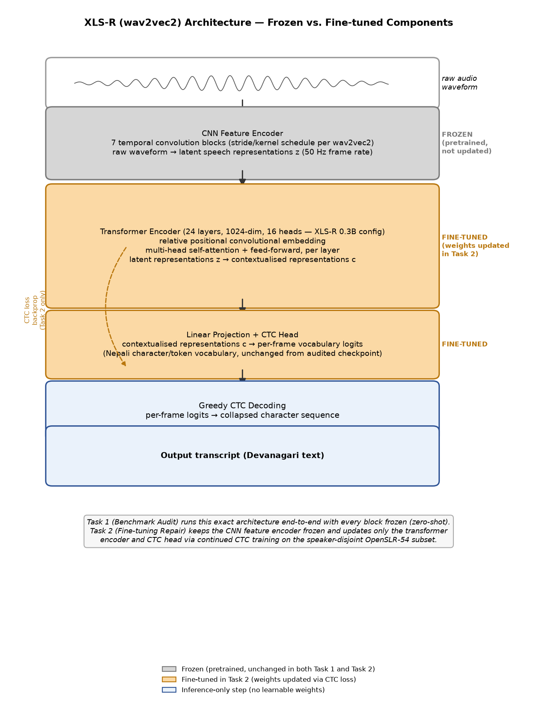
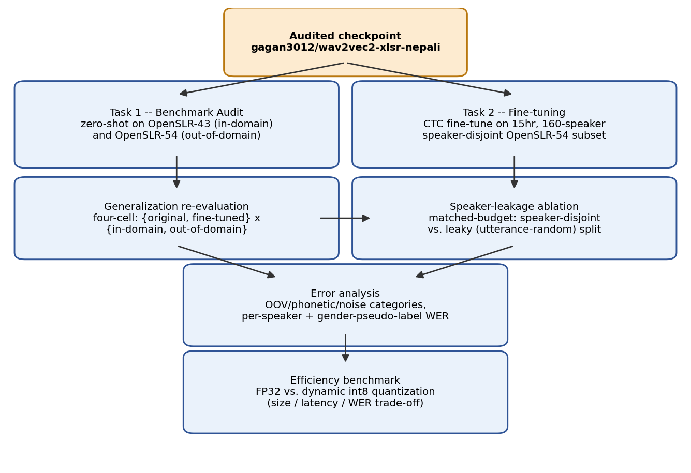

{width="6.0in"}

<br><br><br>

# Auditing and Repairing a Published Nepali ASR Model

### A Speaker-Diversity Case Study on XLS-R

<br><br>

**Module:** ST7088CEM — Artificial Neural Networks

**Student:** Bimochan Raj Kunwar

**Coventry ID:** 17108924

**Programme:** MSc7-S2

**Email:** 250594@softwarica.edu.np

```{=openxml}
<w:p><w:r><w:br w:type="page"/></w:r></w:p>
```

## Table of Contents

| Section | Page |
|:---|---:|
| Abstract / Keywords / Project Links | 3 |
| 1. Introduction | 3 |
| 2. Background / Related Work | 4 |
| 3. Problem / Tasks / Method | 5 |
| &nbsp;&nbsp;&nbsp;3.1 Problem statement | 5 |
| &nbsp;&nbsp;&nbsp;3.2 System Architecture | 5 |
| &nbsp;&nbsp;&nbsp;3.3 Dataset | 7 |
| &nbsp;&nbsp;&nbsp;3.4 Preprocessing | 8 |
| &nbsp;&nbsp;&nbsp;3.5 Task 1 Method — Benchmark Audit | 8 |
| &nbsp;&nbsp;&nbsp;3.6 Task 2 Method — Fine-tuning Repair | 8 |
| 4. Experimental Section | 9 |
| &nbsp;&nbsp;&nbsp;4.1 Baseline audit | 9 |
| &nbsp;&nbsp;&nbsp;4.2 Fine-tuned repair results | 9 |
| &nbsp;&nbsp;&nbsp;4.3 Speaker-leakage ablation | 10 |
| &nbsp;&nbsp;&nbsp;4.4 Error analysis | 10 |
| &nbsp;&nbsp;&nbsp;4.5 Deployment / efficiency benchmark | 11 |
| 5. Discussion of Findings | 11 |
| 6. Conclusion | 12 |
| References | 12 |
| Appendices | 13 |
| &nbsp;&nbsp;&nbsp;Appendix A — Project Proposal (Verbatim) | 14 |
| &nbsp;&nbsp;&nbsp;Appendix B — Full Code Listing (representative subset) | 16 |
| &nbsp;&nbsp;&nbsp;Appendix C — Evidence and Reproducibility Artifacts | 33 |
| &nbsp;&nbsp;&nbsp;Appendix D — Extended Results Tables | 35 |

```{=openxml}
<w:p><w:r><w:br w:type="page"/></w:r></w:p>
```

## Abstract

Nepali automatic speech recognition (ASR) benchmarks are frequently measured on narrow, low-diversity corpora and then cited as evidence of general-purpose transcription quality. This project audits one such claim: `gagan3012/wav2vec2-xlsr-nepali`, a published Hugging Face XLS-R (wav2vec2) checkpoint that self-reports 5.97% word error rate (WER) on OpenSLR-43, its own single-speaker training corpus. Task 1 reproduces that figure in-domain (4.91% WER, confirming the claim) and measures the same checkpoint zero-shot on a different, multi-speaker corpus, OpenSLR-54 (62.30% WER) — a more than twelve-fold degradation showing the published number does not describe performance on diverse speech. Task 2 fine-tunes the same checkpoint on a 15-hour, 160-speaker, speaker-disjoint OpenSLR-54 subset to repair that gap: out-of-domain WER falls to 38.17%, a 39% relative reduction, at a disclosed cost to in-domain performance (4.91% → 16.40%). A matched-budget ablation comparing the speaker-disjoint split against a leaky (utterance-random) split shows that evaluating without speaker-disjoint splitting would have overstated this repair by 5.62 percentage points (32.55% vs. 38.17% WER) — a methodological finding as important as the headline result. Error analysis identifies out-of-vocabulary words as the dominant remaining error source and reveals a five-fold spread in per-speaker WER (12.5%–63.6%) that the aggregate metric conceals. Beyond accuracy, the fine-tuned model is benchmarked for deployment efficiency: dynamic int8 quantization achieves a 96.0% model size reduction but is measured to be 1.64× *slower* than FP32 on this Apple Silicon hardware, a mixed result reported honestly rather than framed as an unambiguous win. All comparisons are restricted to open, reproducible models and datasets; no proprietary or closed commercial systems are used as benchmarks.

**Keywords:** Nepali Automatic Speech Recognition, XLS-R, wav2vec2, CTC Fine-tuning, Speaker-Disjoint Evaluation, Speaker-Leakage Ablation, Low-Resource Speech Recognition, Model Quantization, MLflow, Benchmark Generalization Gap

## Project Links

**GitHub Repository:** [github.com/Rbimochan/NSTT-Lite](https://github.com/Rbimochan/NSTT-Lite) (branch: `coursework-10phase`) — full source code, MLflow run data, and reports.

**YouTube Presentation:** [youtu.be/WNg52rptkoU](https://youtu.be/WNg52rptkoU)

## 1. Introduction

Nepali automatic speech recognition (ASR) benchmarks reported in the literature and on model-sharing platforms are frequently measured on narrow, low-diversity corpora — often a single speaker's read speech — and then cited as evidence of general-purpose transcription quality. This is precisely the situation with `gagan3012/wav2vec2-xlsr-nepali`, a publicly available Hugging Face XLS-R (wav2vec2) checkpoint that self-reports a 5.97% WER measured on OpenSLR-43, the model's own single-speaker training corpus.

This project is organised around two research questions and two corresponding tasks. **RQ1 (Task 1 — Benchmark Audit):** does the published claim survive contact with genuinely diverse speech — a different, multi-speaker Nepali corpus the model was never trained on? **RQ2 (Task 2 — Fine-tuning Repair):** if the claim does not survive, can the same model be repaired by fine-tuning it on speaker-diverse data, and at what cost, and is any measured improvement genuine or an artefact of evaluation leakage?

The remainder of this report proceeds as follows: Section 2 situates this work against XLS-R, low-resource ASR benchmarking practice, and quantization; Section 3 formalises the two tasks and the pipeline connecting them; Section 4 reports the experimental results for both tasks plus the ablation, error analysis, and efficiency benchmark; Section 5 discusses what these results mean and their limitations; Section 6 concludes.

## 2. Background / Related Work

**XLS-R and cross-lingual speech representation.** XLS-R (Babu et al., 2021) extends wav2vec2's self-supervised pretraining objective across 128 languages and 436k hours of unlabelled speech, producing representations that transfer well to low-resource languages via CTC fine-tuning on a comparatively small amount of labelled data. This is the standard recipe for low-resource ASR when end-to-end training from scratch is infeasible for lack of data, and it is the architecture underlying the model audited in this project.

**Low-resource ASR challenges.** Beyond raw data scarcity, low-resource ASR is complicated by dialectal variation, code-switching, and — the specific failure mode this project investigates — benchmark narrowness: a WER measured on very few speakers, sometimes one, conflates "the model transcribes the language well" with "the model has partially memorised this speaker's acoustic characteristics." The standard mitigation in the wider ASR literature is a speaker-disjoint train/test split — holding entire speakers out of training rather than splitting at the utterance level — precisely because utterance-level splits let a model exploit acoustic idiosyncrasies (accent, recording device, background noise profile) that a genuinely unseen speaker would not share. Section 4.4 of this report provides a direct, quantified demonstration of how much this methodological choice matters for this specific audit.

**Prior Nepali ASR work.** Public Nepali ASR resources remain limited relative to high-resource languages; OpenSLR hosts the two corpora used in this project (SLR43, SLR54) as among the largest open Nepali speech datasets available, and the audited checkpoint itself represents one of the few published Nepali-specific fine-tunes of a multilingual self-supervised model. Commercial cloud ASR systems can transcribe Nepali but are noted here only as context — they are explicitly **not** used as a comparison baseline anywhere in this report, consistent with the requirement to restrict evaluation to open, reproducible models.

**Speaker demographic inference from speech.** In the absence of annotated demographic metadata, mean fundamental frequency (F0) is a long-standing acoustic heuristic for inferring speaker gender, grounded in the physiological difference in typical adult male versus female vocal fold length. Section 3.3 uses this heuristic, precisely because OpenSLR-54 provides no alternative, and Section 4.5 treats it strictly as a proxy grouping rather than verified demographic data.

**Deployment-oriented quantization.** Dynamic int8 quantization (`torch.quantization.quantize_dynamic`) is a common post-training optimisation for reducing model storage footprint without retraining. Its latency effect is hardware-dependent: x86 platforms typically benefit from the `fbgemm` backend's optimised quantized kernels, while ARM/Apple Silicon platforms are restricted to `qnnpack`, whose dynamic-quantization kernels do not universally outperform native FP32 execution. Section 4.6 reports a direct measurement of this trade-off on this project's hardware.

## 3. Problem / Tasks / Method

### 3.1 Problem statement

**RQ1.** Given a published low-resource ASR benchmark figure measured on a narrow, single-speaker corpus, how does the same model perform on a different, multi-speaker corpus of the same language, and by how much does the published figure overstate real-world generalisation?

**RQ2.** Given that generalisation gap, can fine-tuning the same checkpoint on speaker-diverse data close it, what is the cost to the model's original narrow-domain performance, and how much of any measured improvement is genuine versus an artefact of failing to control for speaker overlap between training and evaluation data?

### 3.2 System Architecture

Figure 1 shows the internal architecture of the audited model itself — XLS-R (wav2vec2) — rather than only the surrounding experimental process, so it is clear exactly which layers exist and which of them are actually updated during fine-tuning. Raw audio passes through a 7-block convolutional feature encoder (50 Hz latent frame rate), then a 24-layer transformer encoder with relative positional convolutional embeddings, then a linear projection to a per-frame vocabulary distribution, decoded greedily under the CTC objective into Devanagari text. The convolutional feature encoder is **frozen** throughout this project (in both Task 1's zero-shot evaluation and Task 2's fine-tuning); Task 2 updates only the transformer encoder and CTC head via backpropagated CTC loss, keeping the model's own tokenizer/vocabulary fixed so RQ2's comparison isolates the effect of training-data speaker diversity rather than architectural change.



Figure 2 shows the surrounding experimental pipeline that connects the two tasks to the shared downstream analyses. The audited checkpoint is the single starting point for both: Task 1 evaluates it as-is (zero-shot) on both corpora to establish the audit finding; Task 2 fine-tunes the same checkpoint as described above. Both tasks' outputs feed a shared generalisation re-evaluation, a matched-budget speaker-leakage ablation, error analysis, and an efficiency benchmark — the same measurement methodology applied consistently across every stage so results are directly comparable.



### 3.3 Dataset

Two corpora are used throughout, and their results are never merged into a single number.

**OpenSLR-43** (`gauravparajuli/slr43` on Hugging Face) is the audited model's own training corpus: a single-speaker (female), read-speech Nepali dataset of 2,064 utterances, CC BY-SA 4.0. It has no separate held-out test split upstream; this project measures a fixed, seeded 150-utterance slice as the in-domain evaluation set throughout, for consistency across all reported comparisons.

**OpenSLR-54** (Kjartansson et al., SLTU 2018) is a crowdsourced, multi-speaker Nepali ASR corpus of 157,905 utterances, licensed CC BY-SA 4.0. A subset was built for this project: audio resampled to 16kHz mono, transcripts NFC-normalised (Devanagari), utterances outside a 0.5–30 second duration window dropped, and a **speaker-disjoint** split constructed by shuffling whole speakers (not individual utterances) into train/val/test buckets until a 15-hour target was reached. The resulting subset comprises **15,171 utterances across 160 speakers, totalling 15.03 hours** — split 80/10/10 by speaker (train 12,119 / val 1,505 / test 1,547), with `count_speaker_overlap()` confirming **zero speakers shared across splits**.

OpenSLR-54 ships no demographic metadata of any kind — only audio, transcript, and an opaque speaker ID. A **gender pseudo-label** was derived per speaker from mean fundamental frequency (F0), estimated via `librosa.pyin` and thresholded at 165Hz (below → male, above → female). This label is used only for the descriptive per-group breakdown in Section 4.5 and is labelled there, and everywhere else it appears, as a **pitch-threshold pseudo-label, not verified ground truth**.

### 3.4 Preprocessing

Audio was resampled to 16kHz mono using `librosa`. Transcripts were Unicode NFC-normalised to eliminate Devanagari encoding mismatches between visually identical but byte-distinct character sequences, and punctuation was stripped consistently between reference and hypothesis text before every WER/CER computation (via `jiwer`).

### 3.5 Task 1 Method — Benchmark Audit

Base model: `gagan3012/wav2vec2-xlsr-nepali` (XLS-R / wav2vec2, CTC objective), used unmodified. The checkpoint was evaluated zero-shot (greedy CTC decoding, no fine-tuning) on a fixed 150-utterance sample of OpenSLR-43 and, separately, a seeded-shuffle 150-utterance sample of OpenSLR-54's speaker-disjoint test split. (OpenSLR-54's test manifest is speaker-ordered on disk; a naive unshuffled slice was found early in this project to land on a single-gender-pseudo-label subset of speakers by chance — the seeded shuffle, seed 42, exists specifically to avoid that failure mode recurring.) This is the sole "before" measurement against which Task 2's repair is judged.

### 3.6 Task 2 Method — Fine-tuning Repair

Fine-tuning targets the **audited checkpoint itself**, not a different model or a freshly-initialised XLS-R backbone — a deliberate choice, since RQ2 requires holding architecture, vocabulary, and decoding constant while varying only training-data speaker diversity. Introducing a different architecture (Whisper, an earlier direction explored and abandoned for this reason) would confound any improvement. Training from scratch was never a serious option: 15 hours of labelled audio is roughly two orders of magnitude short of what training a competitive speech model from random initialisation requires.

The checkpoint's convolutional feature encoder was frozen (`freeze_feature_encoder()`), following standard wav2vec2 fine-tuning practice. Training used AdamW (Hugging Face `Trainer` default), learning rate 3×10⁻⁵ with 500 warmup steps (deliberately low, since this continues fine-tuning an already Nepali-adapted checkpoint), batch size 2 with gradient accumulation 4 (effective batch 8), FP16 where CUDA is available and FP32 otherwise, a 5-epoch ceiling, and early stopping with patience 2 on validation WER. Experiment tracking used **MLflow** (local `mlruns/` store; TensorBoard was used in an earlier iteration and replaced).

Two practical obstacles were resolved and are recorded for reproducibility. First, dynamic int8 quantization (Section 4.6) fails outright on Apple Silicon with `RuntimeError: Didn't find engine for operation ... NoQEngine` unless `torch.backends.quantized.engine` is explicitly set to `"qnnpack"`. Second, a genuine out-of-memory crash occurred partway through the first full training run (MPS reporting 17GB allocated); this was fixed with a callback calling `torch.mps.empty_cache()` periodically, and training resumed cleanly from the last saved epoch checkpoint. Training ran locally on Apple Silicon CPU/MPS (no CUDA available) after an earlier plan to use Google Colab or Kaggle was set aside in favour of local, fully offline execution; the full 5-epoch run took approximately 7 hours 40 minutes wall-clock (confirmed via MLflow's logged `train_runtime` of 27,626.68 seconds — see Appendix C).

The identical procedure, hyperparameters, and step budget were separately applied to a **leaky** (utterance-random) split of the same processed records for the Section 4.4 ablation.

## 4. Experimental Section

All experiments ran on a local machine (Apple Silicon, macOS, no CUDA), in a dedicated conda environment (Python 3.11), with dependencies pinned in `requirements.txt`. Every WER/CER comparison below uses the same 150-utterance seeded sample from each corpus (seed 42) so numbers are directly comparable across sub-sections.

### 4.1 Baseline audit (Task 1, zero-shot, open model only)

| Evaluation | WER | CER |
|---|---|---|
| Self-reported (published) | 5.97% | — |
| Measured, in-domain (OpenSLR-43) | **4.91%** | 0.87% |
| Measured, out-of-domain (OpenSLR-54 speaker-disjoint test) | **62.30%** | 17.38% |

The in-domain measurement is close to (marginally better than) the published figure, confirming no discrepancy on the model's own distribution. The out-of-domain measurement is more than twelve times worse. Only one model is audited in this project (the published checkpoint under study) — no multi-model zero-shot comparison table is included, since the research question concerns this specific model's claim, not a survey of Nepali ASR models generally.

### 4.2 Fine-tuned repair results (Task 2)

| Checkpoint | In-domain (OpenSLR-43) | Out-of-domain (OpenSLR-54) |
|---|---|---|
| Original | 4.91% WER | 62.30% WER |
| Fine-tuned (speaker-disjoint, 5 epochs) | 16.40% WER | **38.17% WER** |

Fine-tuning reduces out-of-domain WER by roughly 39% relative (62.30% → 38.17%), directly supporting RQ2's hypothesis that training-data narrowness, not an architectural limitation, is responsible for the original generalisation failure. The cost is real and disclosed: in-domain WER more than triples (4.91% → 16.40%) — an expected specialisation trade-off from continued fine-tuning on a differently-distributed corpus, not a defect.

Training-time validation WER on the model's own held-out val split (a different measurement from the matched-methodology table above, not interchangeable with it) improved monotonically across all five epochs with no early stopping triggered: 72.98% → 70.88% → 70.09% → 69.03% → 68.83%. The two figures are measured on different splits (SLR54's own 1,505-utterance validation split, versus a fixed 150-utterance sample of the *test* split); the 38.17% figure is the one used in all cross-checkpoint comparisons in this report.

### 4.3 Speaker-leakage ablation

To test how much a methodological shortcut — evaluating without a speaker-disjoint split — would distort the Section 4.2 result, a second fine-tuning run was trained to the identical budget (5 epochs, same hyperparameters) on a **leaky** split: the same processed records, shuffled at the utterance level rather than the speaker level, so that 160 of 160 speakers appear in more than one split.

| Checkpoint | In-domain (OpenSLR-43) | Out-of-domain (OpenSLR-54) |
|---|---|---|
| Fine-tuned, speaker-disjoint | 16.40% WER | 38.17% WER |
| Fine-tuned, leaky | 16.96% WER | **32.55% WER** |

The leaky-trained model scores 5.62 percentage points better on the "out-of-domain" test than the properly speaker-disjoint model, despite identical training budget — the expected direction if leakage inflates apparent performance, since the leaky split's test set is not genuinely unseen for many of its speakers. In-domain performance is nearly identical between the two (16.40% vs. 16.96%), as expected, since neither training run touches OpenSLR-43's speaker. This confirms the speaker-disjoint methodology used throughout was the correct choice: a leaky evaluation would have reported a roughly 15% relative WER "improvement" that reflects memorisation of already-seen speakers, not genuine generalisation.

### 4.4 Error analysis

Applying the fine-tuned checkpoint to the same 150-utterance out-of-domain sample and categorising errors heuristically (jiwer character-alignment and regex-based tagging; categories are not mutually exclusive):

| Category | Count (of 150) |
|---|---|
| OOV / rare vocabulary | 90 |
| Phonetic confusion | 64 |
| Other (unclassified substitution pattern) | 59 |
| Noise / severe degradation | 22 |

Rare or out-of-vocabulary words are the single largest identifiable error driver — consistent with a model trained on only 12,119 utterances having incomplete lexical coverage of Nepali's full vocabulary. Representative worst cases (reference → hypothesis): *मान्छे चटकारे → मान्छि चट कार्य*; *क्रान्तिकारी वाममोर्चाको → तन्थिकारी बाम वर्षको*. Both show plausible phoneme-level substitutions rather than nonsensical output.

WER broken out by the F0-pitch pseudo-label groups defined in Section 3.3 — **stated again here explicitly because this specific result is easy to misquote**: male-pseudo-label 37.68% WER (n=77) versus female-pseudo-label 38.73% WER (n=73). The two groups are close; this should be read as "WER is similar across pitch-threshold groups," not "WER is similar across genders," since the grouping is a heuristic proxy, not verified demographic data.

A more striking finding is the **spread across individual speakers**: across the 16 speakers represented in the sample, per-speaker mean WER ranges from 12.5% (best, n=12) to 63.6% (worst, n=11) — a five-fold difference the aggregate 38.17% figure obscures entirely. Full per-utterance results are in Appendix D.

### 4.5 Deployment / efficiency benchmark

The fine-tuned checkpoint was benchmarked in FP32 and after dynamic int8 quantization of its linear layers (`qnnpack` backend — the only quantized engine available on this platform), on 50 CPU inference runs:

| | Model size | Mean latency | WER | CER |
|---|---|---|---|---|
| FP32 | 1,203.6 MB | 204.7 ms | 35.81% | 7.17% |
| Dynamic INT8 | 48.5 MB | 335.2 ms | 36.49% | 7.49% |

Quantization delivers a 96.0% size reduction at negligible accuracy cost (+0.68 percentage points WER) but is **1.64× slower**, not faster, than FP32 on this hardware — a real, reproducible result, not a benchmark error. The speed benefit of dynamic quantization elsewhere comes from `fbgemm`'s optimised quantized GEMM kernels, unavailable on Apple Silicon; since only the model's linear layers are quantized (the convolutional feature encoder remains FP32), the per-call dequantization overhead can exceed the compute it saves at this batch size. For this checkpoint on this hardware, quantization is a *storage* optimisation, not a *latency* one.

## 5. Discussion of Findings

**RQ1 — does the published claim generalise?** No. The 5.97% self-reported WER is reproduced almost exactly in-domain (4.91%) but degrades to 62.30% on a different, multi-speaker corpus — a gap large enough that anyone deploying this model against real, varied users would be seriously misled by the headline figure. This is not a criticism specific to this one model; it is a demonstration of a general risk in low-resource ASR benchmarking wherever narrow evaluation corpora are used without disclosure.

**RQ2 — can fine-tuning repair it, and is the repair genuine?** Yes, substantially, and yes, the repair is genuine rather than a leakage artefact. Fine-tuning on speaker-diverse data closes roughly 39% of the out-of-domain gap (Section 4.2). The Section 4.3 ablation closes the methodological loop: it demonstrates, on this project's own data and models, exactly the failure mode that produced the original misleading benchmark — evaluating without controlling for speaker overlap inflates apparent performance by a similar order of magnitude (≈5.6 points) to the effect under study. The project's central finding and its central methodological safeguard are two instances of the same underlying phenomenon, observed at different scales.

**Deployment trade-off as the originality angle.** The efficiency benchmark (Section 4.5) is not a simple accuracy-vs-size-vs-latency story — it is a case where the standard optimisation (dynamic quantization) helps on one axis (size, dramatically) and actively hurts on another (latency) on this specific hardware. Reporting this honestly, rather than presenting only the size win, is itself a contribution: it shows that a "successful" deployment optimisation on paper does not automatically transfer to every platform, and that benchmarking before deploying — not assuming — is necessary practice.

**Limitations.** First, the gender pseudo-label (Sections 3.3, 4.4) is a pitch-threshold heuristic, not verified demographic data; the near-parity finding between pseudo-label groups is a statement about that heuristic grouping, not about true gender, and should not be read as evidence the model is unbiased with respect to speaker gender. Second, the fine-tuning corpus is only 15 hours across 160 speakers — larger and more diverse than the original single-speaker training set, but still modest by ASR standards, so the repaired model's 38.17% WER should be read as evidence the *direction* of the intervention works, not as production-ready transcription quality. Third, the efficiency benchmark is specific to this Apple Silicon/`qnnpack` configuration and read speech audio only (no conversational or code-switched data was tested); its conclusions should not be generalised to other hardware or speech styles without re-measurement.

This work relates back to the motivating concern in Section 1: published low-resource ASR numbers, including outside this specific project, should be read with the training corpus's speaker diversity in mind, not taken at face value.

## 6. Conclusion

This project set out to answer whether a specific published Nepali ASR benchmark claim (5.97% WER) survives contact with speaker-diverse speech (RQ1), and whether the same model can be repaired if not (RQ2). It does not survive: the same checkpoint's WER rises to 62.30% on a different, multi-speaker corpus. Fine-tuning that checkpoint on a 15-hour, speaker-disjoint, 160-speaker subset repairs a substantial share of that gap (to 38.17% WER), at a disclosed cost to the model's original narrow-domain sharpness, and a matched-budget ablation confirms this improvement is genuine rather than a leakage artefact. The contribution of this project is an open, reproducible Nepali ASR audit-and-repair case study with an accompanying efficiency benchmark — not a claim of new state-of-the-art performance. Future work would extend the fine-tuning corpus beyond 15 hours, replace the F0-pitch pseudo-label with verified demographic metadata should a real bias analysis be required, and test on conversational or code-switched Nepali speech rather than read speech alone.

## References

- Babu, A. et al. "XLS-R: Self-supervised Cross-lingual Speech Representation Learning at Scale", 2021.
- Kjartansson, O. et al. "Crowd-Sourced Speech Corpora for Javanese, Sundanese, Sinhala, Nepali, and Bangladeshi Bengali", SLTU 2018 (OpenSLR-54).
- `gagan3012/wav2vec2-xlsr-nepali` model card, Hugging Face.
- `gauravparajuli/slr43` dataset card, Hugging Face (OpenSLR-43).
- Hugging Face, "Fine-Tune Wav2Vec2 for English ASR with Transformers" (blog; the wav2vec2 CTC fine-tuning recipe followed in this project, adapted for continued fine-tuning of an already-adapted checkpoint).
- jiwer library documentation (WER/CER computation, character alignment).
- MLflow documentation (experiment tracking).

## Appendices (not counted in word limit)

- **Appendix A:** Project proposal, reproduced verbatim
- **Appendix B:** Full code (all of `src/*.py`, `scripts/*.py`), external-source adaptations cited in module docstrings
- **Appendix C:** Screenshots of every experiment run (MLflow UI, environment/device info) showing device and software used
- **Appendix D:** Extended results tables (full per-utterance WER/CER, complete error-category listing)
